## Chapter 1 ##
1. .Net Framework provides a feature called platform invoke (P/Invoke)
    - allows code written for .NET to call and use code not written for .NET

## Chapter 2 ##
2. An assembly is either an executable or a DLL.
    - Code in assembly is intermediate language, Common Intermediate Lanuage(CIL)
    
    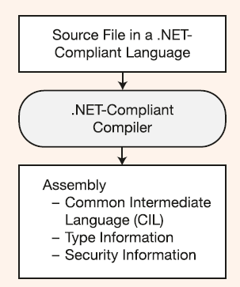  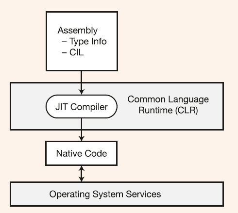

3. CIL compiled to native machine code only when it's called to run. JIT only compiles what is needed, and keep it in memory for future use.
So after JIT compile, the code under the management of CLR, like memory release, checking param's type etc.

    These codes are: *Managed Code*

    On the contrary: code which doesn't run under the control of CLR, say Win32, C++ DLL, is called *Unmanaged code*.

4. What is CLI (Common Language Infrastructure)
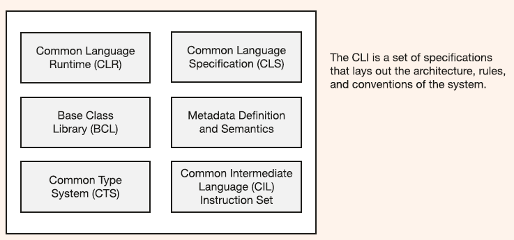

---

>The holy grail - 圣杯，渴望而不可及
>  - something that want very much, but cannot achieve,

---

## Chapter 3 ##
5. The Console type provided via BCL

```C#
Console.WriteLine("The value: {0,-10:C}.", 500); // minus means left alignment
int myInt = 500;
Console.WriteLine($"The value: {myInt,10:C}.");  // 10 is the minimum width

double myDouble = 12.345678;
Console.WriteLine("{0,-10:F4} -- Fixed Point, 4 dec places.", myDouble);     // ==> 12.3457
```
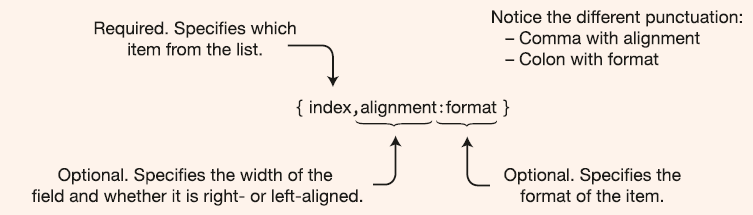


## Chapter 4 ##
- C    - functions and data types

- C++  - functions and classes.

- C#   - a set of type declarations


- What is type?
  - A template for creating data structures.
    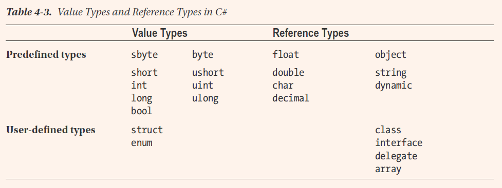

- decimal can represent decimal fractional numbers exactly. used for monetary calculations.

- dynamic 
  - Used when using assemblies written in dynamic languages,
  - Like IronPython, IronRuby these are .NET languages as well, but they are dynamically typed.
  - If a variable declared as dynamic, it will not do the type check in compile time, 
  - But package the info and operation together then trying to use it in run time, if cannot be run, throw exception.

- A running program uses two regions of memory to store data: ***stack*** & ***heap***
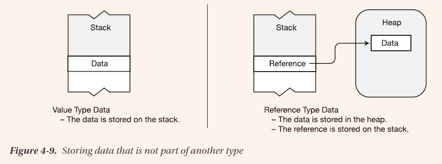
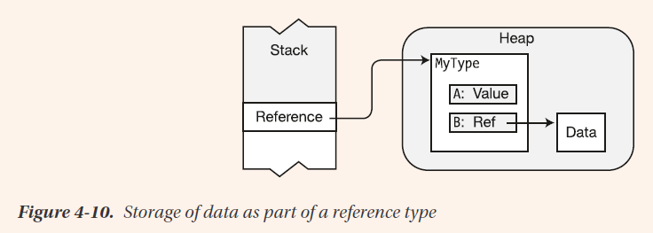
> For any object of a reference type, all its data members are stored in the heap, regardless of whether they are of value type or reference type.

## Chapter 5 ##
> A running program is a set of objects interacting with each other.

## Chapter 6 ##
- Beginning with C# 7.0 you can declare a separate method inside another method.
- Isolate the inner method from outside.
- Called *local functions*

- Formal parameter Vs Actual parameter(argument)
 - Formal parameter is the parameter used for declare the method.
 - Actual parameter is the value used for invoke the method.

- Value Parameters Vs Reference Parameters
  - For value parameters, the system allocates memory on the stack for formal parameters.
  
  - Reference parameters ***DO NOT*** allocate memory on the stack for the formal parameteres.
    - The formal parameter name acts as an ***alias*** for the actual parameter variable, referring to the same memory location.
  ```c#
    void MyMethod(ref int val) {...}
    int y = 1;
    MyMethod(ref y);
  ```

- *Output parameters*
  - Like reference parameters, the formal parameters of *output parameters* act as *aliases*
  ```c#
    MyMethod(out MyClass a1, out int a2);
  ```

- *parameter Arrays*
  ```c#
    void ListInts(params int[] inVals) {...}
  ```
    - Expanded Form
      ```c#
        ListInts( 1, 2, 3 );
      ```

### Ref Local and Ref Return
- *ref local* allows a variable to be an alias for another variable.
  ```c#
    static void Main() {
      int x = 2;

      ref int y = ref x;    // *ref local* feature
      Console.WriteLine($"x = {x}, y = {y}");   // x = 2, y = 2

      y = 5;
      Console.WriteLine($"x = {x}, y = {y}");   // x = 5, y = 5

      x = 6;
      Console.WriteLine($"x = {x}, y = {y}");   // x = 6, y = 6
    }
  ```

- *ref return* lets you send a reference *out of a method* where it can be used in the calling context.
  - Some constrains, page 116.
  ```c#
    class Simple
    {
      private int Score = 5;

      public ref int RefToValue()     // *ref return*
      {
        return ref Score;
      }

      public void Display()
      {
        console.WriteLIne($"Value inside class object: {Score}");
      }
    }

    class Program
    {
      static void Main()
      {
        Simple s = new Simple();
        s.Display();

        ref int v1Outside = ref s.RefToValue();     // ref local conjunction with ref return
        
        v1Outside = 10;
        s.Display();
      }
    }
  ```

### Stack Frames ###
- When a method is called, memory is allocated at the top of the stack to hold a number of data items associated with the method.
- This chunk of memory is called the *stack frame* for the method.

## Chapter 7 More About Classes ##
- public static int MaxVal;
- static public int MaxVal;
    - These are the same, `public` and `static` are both [modifiers]
    - public, protected, private, static, const, 

- Static using statement
```c#
using static System.Console;
using static System.Math;

WriteLine($"The squre root of 16 is { Sqrt(16) }");
```

- Constant acts like a static, but it does not allocate memory space in heap, do not have their own storage locations,
- Only substituted in by the compiler at compile time. 
- Cannot declared as static
    ```c#
        static const double PI = 3.14;      // Error: can't decalre a constant as static
    ```

- Property, like a field
    - It is a named class member.
    - It has a type
    - It can be assigned to and read from.

- But unlike a field, however, a property is a ***function member***
    - It does not necessarily allocate memory for data storage.
    - It executes code.
    - ***accessors***

- Static constructor
    - *Static constructors* initialize the *static fields* of the class
    - There can be only a single static constructor for a class, and it cannot have parameters.
    - cannot have accessibility modifiers.(`public` or `private`)
    - You cannot explicityly call static constructor, system will call it automatically, at some indeterminate time.
        - Before any instancer of the class is created
        - Before any static member of the class is referenced.

- Object initializer
    - first: finish execute the constructor, then initialize the values
    ```c#
        new Point { X = 5, Y = 6 };
    ```

- Unmanaged resources
    - things such as file handles that you've gotten using the Win32 API, or chunks of unmanaged memory.

- Indexer
    - is a pair of *get* and *set* accessors.
    - does not allocate memory, like property
    - always ***instance member***, cannot be ***static***
    ```c#
        ReturnType this [ Type param1, ... ]
        {
            get { ... }
            set { ... }
        }
    ```

- Partial method
    - No access modifier, implicitly `private`
    - return void
    - no `out` parameter
    - include `partial void methodName() { ... }`

## Chapter 8 Classes and Inheritance ##
- Call order
    1. Member initialize
    2. Base class constructor
    3. Derived class constructor
```c#
   class MyDerivedClass : MyBaseClass
   {
      int MyField1 = 5;                      // 1. Member initialized
      int MyField2;                          //    Member initialized
      public MyDerivedClass()                // 3. Body of constructor executed
      {
         ...
      }
   }
   class MyBaseClass
   {
      public MyBaseClass()                   // 2. Base class constructor called
      {
         ...
      }
   }
```

- So, calling virtual method in Base class constructor is strongly disouraged.
    - The virtual method in base class constructor will call the override method in derived class.
    - That would be ***before*** the derived constructor execute.
    - Calling the derived class before it is completely initialized.

- Verbatim string literal
  - @"dkjfa"
  - sets of contiguous double quotes are interpreted as a single double quote character.
  ```c#
    string vst2 = @"It started, ""Four score and seven...""";
  ```

## Chapter 9 Expressions and Operators ##
- Delegates is reference type and use deep comparison.
  - When delegates compare for equality, return `true` when:
    - both are `null`
    - both have the ***same number**** of members in their invocation lists and invocation lists ***match***.

- Bitwise manipulation of signed numbers
  - The underlying hardware represents signed binary number in a form called ***two's complement*** 二进制补码
  
- 就像一个操场跑道，你站在右边，想去左边的某个点：
    - 你可以跑一整圈过去（很慢）
    - 也可以直接穿过操场到对面（很快）
    - 补码就是第二种。

- 这个是怎么来的？
  1. 一切的***起点***: 机器只有加法器，没有减法器
  2. 我们想算 a - b = result,
  3. 我们想用 a + (某个数) = result
  4. 这样，我们就可以用*某个数*作为 *-b*的计算机表示形式。
  5. 在8位计算机中，数从0开始到255， 然后再加一就又变成0，想象成操场。 
      - 想象成一个一圈有256米的跑道，一个小朋友从*任意点*米开始跑，跑256米之后，又回到了*任一点*的位置。
      - 所以如果一个小朋友从10米开始跑，他想跑到9米的位置，他不能往后跑，只能往前跑，那么他就要跑255米。
        - 这就是 10 - 1 的结果，就等于 10 + 255 的结果，
        - 那么 *255* 就是 *-1* 的二进制表示， 在 *8* 位的计算机当中。
      
      - 如果想从10米跑到7米，那么 就要往后跑3米（减法），或者往前跑 256 - 3 = 253米（加法）
        - 那么 *253* 就是 *-3*的二进制表示，也是在 *8* 位的计算机当中了。
      
      - 所以 a - 4 = a + (256 - 4)
        - 想得到 a 减去一个数的值，就用 a 加上这个数的模就可以了。

      - 其实就是数学中 *模* 的概念。
  6. 然后我们就得到了对应负数的计算机二进制表示
      - -1 = 256 - 1 = 255  (1111 1111)
      - -2 = 256 - 2 = 254  (1111 1110)
      - -127 = 256 - 127 = 129 = (1000 0001)
        - 就是：
         - （-正数）= 负数 = (2ⁿ - 正数)
  7. 最自然的结果就是
      - 负数区就是最高位=1的数（二进制）
      - 在模2ⁿ的 "后半圈"
  8. 最终才有 " 最高位 = 1 是负数 " 这个规则。
  9. 最后大家发现，正数按位取反 + 1就是负数的二进制，于是 取反+1 成为了补码的简便算法。

- ⭐ 所以整个逻辑顺序是这样的：
  - ① 目标：让计算机用同一个加法器处理加法和减法
  - ② 数学结论：负数必须是 “2ⁿ − x” 的形式
  - ③ 这样推出来：高位恰好变成 1（因为数值落在后半段）
  - ④ 才有 “最高位=1 表示负数” 的规则
  - ⑤ 最后发现巧合：“取反+1” 就是 “2ⁿ − x” 的快速算法
  - 补码不是随便规定的，它是 自然推导 出来的。

⭐ 一句话总结
  - 1000 0001 代表 -127，不是因为规定，而是因为在 8 位二进制的模 256 世界里：
  - 1000 0001 = 129，而 129 是从 256 往回数 127 个，所以它表示 -127。

- Operator overloading
  ```c#
    public static LimitedInt operator - (LimitedInt x) { ... }
  ```

- A ***resource*** is a class or struct that implements the `System.IDisposable` interface.

## Chapter 12 Enumeration ##
- Enums are value types
- The members are static, which, as you'll recall, means that they are accessible even if there are no variables of the enum type.

## Chapter 13 Arrays ##
- Multidimensional
  - Rectangular arrays
    ```c#
      int[,] intArr = new int[4, 6];   // One set of square brackets
      System.Console.WriteLine(intArr.Rank);    // Output is: 2

      int[] arr = new int[] { 10, 20, 30 };
      var arr = new[] { 10, 20, 30 };
      var arr = new int[3];   // All values default
    ```
  - Jagged arrays
    - Array of independent arrays
    ```c#
      int[][] y = new int[2][];   // Three sets of square brackets

      int[][] SomeArr; // Rank = 1
      int[][][] OtherArr; // Rank = 1

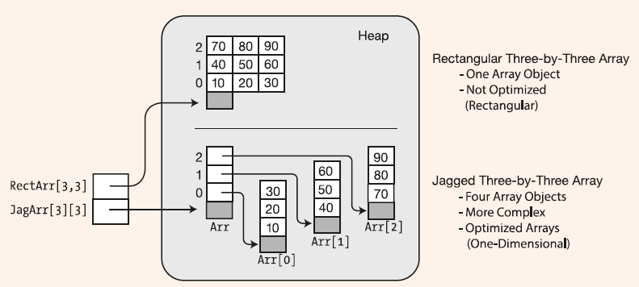

### Array Covariance ###
- Array is a reference type array.
- There's an implicit or explicit conversion.
  - So, you can always assign an object of a derived class to an array declared for the base class.

- No covariance for value type arrays.

### Array clone ###
- shallow copy
- Cloning a value type array results in two independent arrays.
- Cloning a reference type array results in two arrays pointing at the same objects.
- The *Clone* method returns a reference of type **object**, which must be cast to the array type.
  ```c#
    int[] intArr1 = { 1, 2, 3 };
    int[] intArr2 = (int[]) intArr1.Clone();
  ```

### Array and Ref Return and Ref Local ###
P346

## Chapter 14 Delegates ##
- Delegate as class is a user-defined ***type***.
- Holds one or more methods and a set of predefined operations.
- Mehtods in the invocation list can be either instance methods or static methods.
- Delegate is reference type, therefore has both a reference and an object.
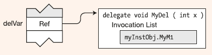
- After assing the different delegate, the old delegate object will be disposed by GC.
```c#
  delegate void MyDel(int x);
  MyDel delVar;
  delVar = myInstObj.MyM1;
  delVar = SClass.OtherM2;
```
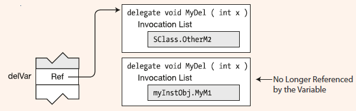

- Delegates are immutable.
```c#
  MyDel delA = myInstObj.MyM1;
  MyDel delB = SClass.OtherM2;
  MyDel delC = delA + delB;
```
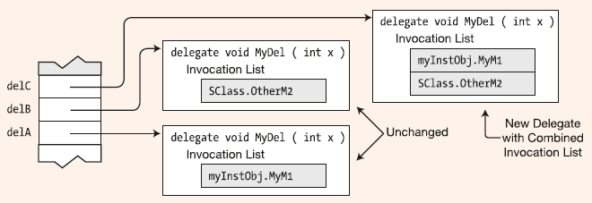

- C# provide the syntax, looks like you can add a method to a delegate, "+="
  - What is actually happening?
    - Everytime the += operator is used, a new delegate is created, with an invocation list that is the combination of the delegate on the left and the method listed on the right.
    - The new delegate is then assigned to the delVar variable.
- Also, you can add a method to a delegate more than once.

- The value returned by the last method in the invocation list is the value returned from the delegate invocation.
- All the other return values from other methods are ignored.
```c#
  delegate int MyDel( ); // Declare delegate with return value.
  
  class MyClass {
    int IntValue = 5;
    public int Add2() { IntValue += 2; return IntValue;}
    public int Add3() { IntValue += 3; return IntValue;}
  }

  class Program {
    static void Main( ) {
      MyClass mc = new MyClass();
      MyDel mDel = mc.Add2; // Create and initialize the delegate.
      mDel += mc.Add3; // Add a method.
      mDel += mc.Add2; // Add a method.
      Console.WriteLine($"Value: { mDel() }");
    }
  }

  /// Value: 12
```
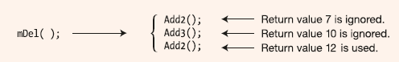


- If delegate has a reference parameter, the new value of the parameter pass to the next method.
```c#
  delegate void MyDel( ref int X );

  class MyClass {
    public void Add2(ref int x) { x += 2; }
    public void Add3(ref int x) { x += 3; }

    static void Main() {
      MyClass mc = new MyClass();
      MyDel mDel = mc.Add2;
      mDel += mc.Add3;
      mDel += mc.Add2;

      int x = 5;
      mDel(ref x);
      Console.WriteLine($"Value: { x }");
    }
  }

  /// Value: 12
```
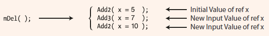

- You can omit the anonymous parameters or even the paratheses all together, when both are true,
  1. no **out** parameters
  2. parameters are not used in the anonymous delegate.

- The delegate has the **params** parameters, the anonymous method's parameter list, **must omit** the params keyword.
```c#
  delegate void SomeDel(int x, params int[] y);
  SomeDel mDel = delegate (int x, int[] y) { ... }
```

- Use lambda, if lambda expression emerges before anonymous methods, then anomymous methods may not be invented anymore.

## Chapter 15 Event ##
- An event has an encapsulated delegate.
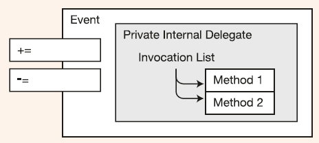

- In order to use event, there're ***five*** pieces of code.
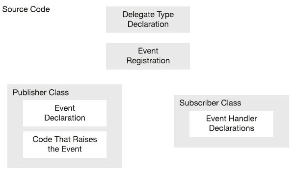

- Declaring an Event
  1. inside a class
  2. requires the name of a delegate type.
    - Any event handlers attached to the event **must match** the delegate type in signature and return type.
```c#
  class Incrementer
  {
    public event EventHandler CountedADozen;
    // event         --> Keyword
    // EventHandler  --> Delegate type
    // CountedADozen --> Name of the event
  }
```