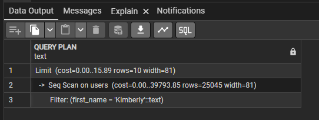
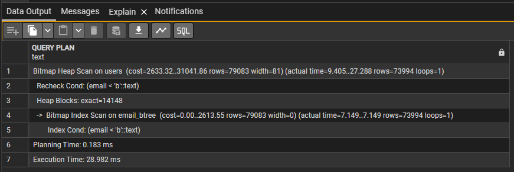
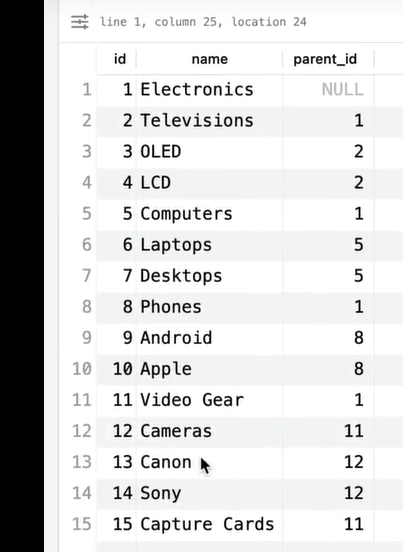

- in psql command line
    - \l -> list all the datatabase
    - \c NewDb -> switch databases

-- 31. Text search type
create table ts_example (
	id bigint generated always as identity primary key,
	content text,
	search_verctor_en tsvector generated always as (to_tsvector('english', content)) stored
)
insert into ts_example (content) values ('The quick brown fox jumps over the lazy dog')
insert into ts_example (content) values ('The quick brown fox jumps over the cat')
select * from ts_example where search_verctor_en @@ to_tsquery('cat')


-- 32. Bit string
select b'0101' & B'0001'  -- bit mask
create table bits_example (
	bit3 bit(3),
	bitv bit varying(32)
)
insert into bits_example (bit3, bitv) values ('011', '01010100011101')
insert into bits_example (bit3, bitv) values (b'101', b'0101010001')
select * from bits_example


-- 33. Ranges
select '[1, 5]'::int4range   -- [1, 6) 6 exclusive
-- int range has discrete steps
-- 1, 2, 3, 4, 5
-- date range has discrete steps, day by day

select '[1, 5]'::numrange  -- [1, 5] 5 inclusive
-- num range is continuous, no discrete step
-- the number is infinity, like:
-- 1, 1.0000000000001, 1.000000000002 ...
-- timestamp functionally the same thing

select numrange(1, 5, '(]');

CREATE TABLE range_example (
	id BIGINT GENERATED ALWAYS AS IDENTITY PRIMARY KEY,
	int_range INT4RANGE,
	num_range NUMRANGE,
	date_range DATERANGE,
	ts_range TSRANGE
)

INSERT INTO range_example (int_range, num_range, date_range, ts_range)
VALUES
('[1,11)'::int4range, '[0.5,5.5)'::numrange, '[2023-01-01,2024-01-01)'::daterange, '["2023-09-01 00:00:00","2023-09-30 23:59:00"]'::tsrange),
('[2,101)'::int4range, '(0.0,10.0]'::numrange, '[2022-01-01,2022-06-01)'::daterange, '("2023-01-01 00:00:00","2023-01-10 12:00:00"]'::tsrange),
('[10,20)'::int4range, '[1.0,2.0)'::numrange, 'empty'::daterange, 'empty'::tsrange),
('[5,)'::int4range, '[1.0,)'::numrange, '(,)'::daterange, '(,"2023-01-01 00:00:00")'::tsrange);
select * from range_example

-- '@>' check if a range contains a value
select * from range_example where int_range @> 5

-- check if two range overlap, '&&'
select * from range_example where int_range && '[20, 22]'

-- intersection of 2 ranges
select int4range(10, 20) * int4range(15, 25)
select int4range(10, 20, '[]') * int4range(15, 25)
-- inclusive, exclusive, continous range, discrete range

-- upper / lower
select upper(int4range(10, 20, '[]')), upper_inc(int4range(10, 20, '[]'))

-- multi-range
select '{[3, 7), [8, 9)}'::int4multirange @> 7


-- 34. Composite types
create type address as (
	number text,
	street text, 
	city text,
	state text,
	postal text
);
select row('123', 'Main St', 'Anytown', 'ST', '12345')::address    -- can do without 'row'

create table addresses (
	id bigint generated always as identity primary key,
	addr address
)
insert into addresses (addr) values(('123', 'Main St', 'Anytown', 'ST', '12345'))

select id, (addr).street from addresses -- paranthesis is must


-- 35. Nulls
-- you will get a lot good thing from restrain the column not nullable, like indexing, grouping, comparing, sorting etc.
create table products (
	id bigint generated always as identity primary key,
	name text not null,
	price numeric not null check(price > 0)
)
insert into products (name, price) values ('chest', '20.4234')
insert into products (name, price) values ('majiang', 0)
select * from products
drop table products


-- 36. Unique constraints
-- Primary key auto add not null and unique
-- can insert null into uqniue column
-- allow null but not distinct, you only allow 1 null in the column
-- Unique can be used for the combination of the columns, used as talbe constraint


-- 37. Exclusion constraint
-- GIST: a type of index
-- && is overlap check, if it's overlap then excluded
CREATE TABLE reservations (
	id BIGINT GENERATED ALWAYS AS IDENTITY PRIMARY KEY,
	room_id INTEGER,
	reservation_period TSRANGE,
	EXCLUDE USING GIST (reservation_period WITH &&)
)

INSERT INTO reservations (room_id, reservation_period) VALUES (1, '[2023-09-01 14:00, 2023-09-03 12:00)');
select * from reservations

-- but if someone want to book to another room, it still cannot book, since the overlap exclusion constrain
INSERT INTO reservations (room_id, reservation_period) VALUES (2, '[2023-09-02 14:00, 2023-09-04 12:00)');

drop table reservations
-- we need to check the room in the exclusion constrain as well 
CREATE TABLE reservations (
	id BIGINT GENERATED ALWAYS AS IDENTITY PRIMARY KEY,
	room_id INTEGER,
	reservation_period TSRANGE,
	EXCLUDE USING GIST (room_id WITH =, reservation_period WITH &&)
);

-- but the gist doesn't have the default = operation for integer, we need to enable the btree_gist
-- after enable the btree_gist, we can run the create table again.
CREATE EXTENSION IF NOT EXISTS btree_gist;

INSERT INTO reservations (room_id, reservation_period) VALUES (1, '[2023-09-01 14:00, 2023-09-03 12:00)');
INSERT INTO reservations (room_id, reservation_period) VALUES (2, '[2023-09-02 14:00, 2023-09-04 12:00)');
INSERT INTO reservations (room_id, reservation_period) VALUES (2, '[2023-09-01 14:00, 2023-09-04 12:00)');


-- Then what if the reservation being cancled? we add a enum in the table, here using text instead, no time to do that :)
drop table reservations;
create table reservations (
	id bigint generated always as identity primary key,
	room_id integer,
	booking_status text,
	reservation_period tsrange,
	exclude using gist (room_id with =, reservation_period with &&)
);

insert into reservations (room_id, booking_status, reservation_period) 
values (1, 'canceled', '[2023-09-01 14:00, 2023-09-03 12:00)');
select * from reservations

-- based on the previous definition, we can't insert a confrimed book record, even the previous one canceled
insert into reservations (room_id, booking_status, reservation_period) 
values (1, 'confirmed', '[2023-09-01 14:00, 2023-09-03 12:00)');

-- we need to re-define the table, add the where constraint to the exclude
drop table reservations;
create table reservations (
	id bigint generated always as identity primary key,
	room_id integer,
	booking_status text,
	reservation_period tsrange,
	exclude using gist (room_id with =, reservation_period with &&) where (booking_status != 'canceled')
);

select * from reservations

-- then try to insert two overlapped records with different booking_status, can only confirm once.
insert into reservations (room_id, booking_status, reservation_period) 
values (1, 'canceled', '[2023-09-01 14:00, 2023-09-03 12:00)');
insert into reservations (room_id, booking_status, reservation_period) 
values (1, 'confirmed', '[2023-09-01 14:00, 2023-09-03 12:00)');


-- 38. Foreign-key constraint
create table states (
	id bigint generated always as identity primary key,
	name text
);
create table cities (
	id bigint generated always as identity primary key,
	state_id bigint references states(id),
	name text
);
insert into states (name) values ('Shaanxi');
select * from states;
insert into cities (state_id, name) values (1, 'xi''an')
select * from cities

-- Or you can define the foreign key on table level,
-- this can also used for composite foreign key
drop table cities;
create table cities (
	id bigint generated always as identity primary key,
	state_id bigint, 
	name text,
	foreign key (state_id) references states(id)   -- on delete no action / restrict / cascade
);
insert into cities(state_id, name) values (1, 'xi''an');

-- difference between no action / restrict? 
	-- no action allow check deferred to later transaction


-- 39. Introduction to indexes
	-- When creating a index for a column, 
	-- it's actually create a separate index table, which including
		-- that column data
		-- and a pointer to point to the physical address of that record
	-- normally it uses b-tree to create for easy traverse and fast lookup
	
	-- So it's better to not create index for every columns of a table, slow down the database
		-- When update the table, the index needs to update as well.


-- 40. Heaps and CTIDs
	-- index contains a pointer point back to the table.
	-- How does postgresql store rows under the hood, how does it write the data to disk?
		-- postgres has a bunch of pages (eaqual size blocks), in the page, there are rows
		-- so, you can easily get the data from page 5 row 8
	
	-- postgres put the data in whereever it can, 
		-- like page5 row8, page10 row2, 
		-- it's a heap, fast to store and lookup
		
select *, ctid from reservations -- where ctid = '(0,4)' 
-- ctid (0, 4), means data in page 0, position 4
-- you can use a where clause for ctid, HOWEVER DON'T, these ctids will change after vaccum the database.

-- Every index contains the ctids, that's the actually pointer to get you back to the table to find the data.

### 41. B-tree overview ###
-- Most common index type
```sql
CREATE TABLE users (
    id INT GENERATED ALWAYS AS IDENTITY PRIMARY KEY,
    name TEXT NOT NULL,
    email TEXT NOT NULL
);

INSERT INTO users (name, email) VALUES
('Aaron','aaron@example.com'),
('Steve','steve@example.com'),
('Jennifer','jennifer@example.com'),
('Simon','simon@example.com'),
('Amelia','amelia@example.com'),
('Isaac','isaac@example.com'),
('Virginia','virginia@example.com'),
('Adam','adam@example.com'),
('Taylor','taylor@example.com'),
('Ian','ian@example.com');

select * from users;
```
-- so the b-tree looks like:

    - All the index in the leaf node
    - leaf nodes have the ctid to point to the original record in database.


### 42. Primary keys vs. secondary indexes ###
- Clustered index
    1. determines the physical order of the row in the table. ❤️
    2. can be only one clustered index per table.
    3. Leaf nodes of the index contain the actual rows.

- mysql / sql server
    - automatically make the primary key the clustered index, but this is a database design choice, not a rule.

- Secondary index
    1. is an additional index, *DO NOT* control the physical order of the table.
    2. leaf stores *index key* + *pointer to the row*
    3. table order no change
    4. a table can have multiple secondary indexes.

| Feature                 | Clustered Index | Secondary Index       |
| ----------------------- | --------------- | --------------------- |
| Physical order of table | Yes             | No                    |
| Number allowed          | 1               | Many                  |
| Leaf nodes store        | Actual rows     | Row pointers          |
| Query speed             | Very fast       | Fast but needs lookup |

- In postgres
    - there's no `true` clustered index by default, all indexes are secondary index.
    - All the data is stored in heap, big old pile.
    - 这个clustered说明了数据在内存中存贮的方式，是连在一起的(mysql/sqlserver)。

- 而postgres，数据在内存中位置是不固定的，所以在postgres里没有clustered index, so all indexes in postgres are secondary indexes.

### 43. Primary key types ###
- What data type should you use for primary key? Integer or UUID ?
    - 98% --> *bigint*
    - When adding new, the id always grows, re-blancing b-tree more easier than inserting random id

- UUID
    - 7 variants of UUID,
        - ULID
        - UUIDV7
            - time ordered UUID.
            - doesn't have the in-efficient re-balance b-tree issue.
    - random UUID will cause b-tree re-balanced and re-structured.

- When should you use UUID
    - size: UUID is 16 bytes
    - Need to generate the id without talking to the database, without coordinate with other parts.
    - use a *time ordered* variant
        - v7 or  ulid

- Security concern about sequenced bigint, since people can guess the id of the item based on the URL etc.
    - people can guess how many user you have, how many invoices you have created, etc.
    - solution:
        - have a public id alongside your bigint primary key.
        - create a secondary key, like a nano id, very compact, very random, impossible guess

### 44. Where to add indexes ###
```sql
    explain select * from users where birthday = '1989-02-14'
```

- Without index it will show Parallel Seq Scan

- Adding the index via
```sql
    create index bday on users using btree(birthday);
```


- if you want to order the column, better to index it
- So the index is using in select, order, group, you can use explain to check in sql

```sql
    -- create new user table
    CREATE TABLE users (
        id BIGINT GENERATED ALWAYS AS IDENTITY PRIMARY KEY,
        first_name TEXT NOT NULL,
        last_name TEXT NOT NULL,
        email TEXT NOT NULL,
        birthday DATE,
        is_pro BOOLEAN DEFAULT FALSE,
        deleted_at TIMESTAMPTZ NULL,
        created_at TIMESTAMPTZ NOT NULL,
        updated_at TIMESTAMPTZ NOT NULL
    );  

    -- generate 989908 rows of records.
    INSERT INTO users (
        first_name,
        last_name,
        email,
        birthday,
        is_pro,
        created_at,
        updated_at
    )
    SELECT
        'User' || g,
        'Test',
        'user' || g || '@example.com',
        DATE '1970-01-01' + (random() * 20000)::int,
        (random() < 0.5),
        now() - (random() * interval '2000 days'),
        now() - (random() * interval '1000 days')
    FROM generate_series(1, 989908) AS g;   

    explain select * from users where birthday = '1989-02-14'
    explain select * from users where birthday between '1989-01-01' and '1989-12-31'
    create index bday on users using btree(birthday);
    explain select count(*), birthday from users group by birthday;
```

### 45. Index selectivity ###
- two criteria to decide if the column is a good candidate for index
    1. *cardinality*
        - Number of discrete or distinct values in the column
        - e.g.: a column with boolean value, the cardinality is 2, (true/false), only can have two distinct values

    2. *selectivity*
        - ratio 
        - How many distinct values are there as a percentage of the total number of rows in the table.
        - If a boolean column only have two rows data(one is true, another is false), then the selectivity is 100%, select once can get the value we want.
        - The closer we get to one, the better we get
- So the `is_pro` column is boolean, which has the selectivity is pretty low "0.000002020389773595121971"
    - Question:
        - In what scenario, indexing a boolean column is good/bad?

```sql
    select 
    	(count(distinct birthday)/count(*)::decimal)::decimal(7, 4)
    from users;
    
    -- selectivity closer to 1, better
    select 
    	(count(id)/count(*)::decimal)::decimal(7, 4)
    from users;
    select 
    	count(distinct is_pro)/count(*)::decimal
    from users;
    
    select count(*) filter(where is_pro is true) from users;
    -- When the data is not skewed, like true/false is distributed in this table, the selectivity even better than birthday
    select 
    	(count(*) filter(where is_pro is true)/count(*)::decimal)::decimal(7, 4)
    from users;
    
    -- this is using index scan (why)
    explain select * from users where birthday < '1989-02-14'
    select count(*) from users where birthday < '1989-02-14'  --345k
    -- answer: this results get less than half of the table, postgres decide to use the index.
    
    -- this one using Seqence scan (why)
    explain select * from users where birthday > '1989-02-14'
    select count(*) from users where birthday > '1989-02-14' --643k
    -- So in here, the index doesn't assist us more, since the result is more than half of the table rows.
    -- Postgresql will decide if the index is not eliminate enough rows, it just goes straight to table
    
    -- postgres keep these data under the hood, can be updated by running analyse table or auto vaccume, not get it real-time.
```

### 46. Composite range ###
- Rules
    - Left most prefix rule:
        - Left to right no skipping
        - stops at the 1st range

- So most common condition should go to the MOST LEFT side when defining index
```sql
    create index multi on users using btree (first_name, last_name, birthday);
    explain select * from users where last_name = 'Francis';     -- this is not using the newly created index her

    -- because we declare our composite index first_name first, then last_name, then birthday, ORDER MATTERS
    -- This is left most prefix rule.

    explain select * from users where first_name='eric';    -- this is using the index

    -- this one skipping the last_name, but still using index to scan, because postgres do the optimization.
    -- index scan the first_name then seq scan the birthday
    explain select * from users where first_name='allen' and birthday='1989-02-14'

    -- if we create a new multi index only for first_name and birthday
    create index multi2 on users using btree(first_name, birthday);

    -- then we can notice that the multi2 index is being used for only first_name and birthday filter
    explain select * from users where first_name='allen' and birthday='1989-02-14'

    -- So most common condition should go to the MOST LEFT side when defining index
```

### 47. Composite range ###
- You want your index from left to right
    - *LEFT <-- most commonly used -- strict equality -- range --> RIGHT*
    - If you skip a column or encounter the range, database starts scanning, 
    - postgres sometimes has optimized a bit.

```sql
    -- create two different indexes
    create index first_last_birth on users using btree(first_name, last_name, birthday);
    create index first_birth_last on users using btree(first_name, birthday, last_name);

    -- It will pick the one which most efficient.
    explain select * from users where first_name='User123' and last_name='Test' and birthday < '2005-02-14';
    explain select * from users where first_name='User123' and birthday < '2005-02-14' and last_name='Test'
```

### 48. Combining multiple indexes ###
- When we have two columns have index respectively, and create a combined index including these two columns
    - postgres will decide which index will be use.
    - base on your data, your scenario, you need to test it out to know exactly which index it's gonna use.
- Normally
    - When you *and* a filter, it will use the combined index.
    - When you *or* a filter, it will use the individual one and use BitmapOr to combine the result. (I didn't see the BitmapAnd / BitmapOr, maybe the dataset I have a bit different)

```sql
    create index "first" on users using btree(first_name);
    create index "last" on users using btree(last_name);

    -- if combined index not create, use first index
    explain select * from users where first_name = 'User1323' and last_name='Test';
    explain select * from users where first_name = 'User1323' or last_name='Test';

    create index first_last_index on users using btree(first_name, last_name);

    -- first_last_index
    explain select * from users where first_name = 'User1323' and last_name='Test';

    -- seq scan
    explain select * from users where first_name = 'User1323' or last_name='Test';
```

### 49. Covering indexes ###
- no need to go back to heap to grab all the data, all the indexes already have these data and return directly
- The created multi index *indludes* all the data we want to query.

```sql
    -- check all the indexes for specific table
    select * from pg_indexes where tablename='users';

    -- Generate the drop index statements, except the primary key constraint
    SELECT
        'DROP INDEX IF EXISTS ' || schemaname || '.' || indexname || ';'
    FROM pg_indexes
    WHERE tablename = 'users'
    AND indexname NOT LIKE '%_pkey';
```

```sql
    -- (1) shorthand syntax
    create index "first" on users(first_name);
    -- index scan
    explain select * from users where first_name='User1231';
    -- index only scan
    explain select first_name from users where first_name='User1231';

    -- (2) combined index
    drop index "first";
    create index "first_last" on users(first_name, last_name);
    -- index only scan
    explain select first_name from users where first_name='User13223';
    explain select first_name, last_name from users where first_name='User13223';
    -- index scan
    explain select id from users where first_name='User13223';

    -- (3) including other info
    drop index "first_last";
    create index "multi" on users(first_name, last_name) include (id);
    -- index only scan, since the leaf nodes in btree including the id info.
    explain select first_name, last_name, id from users where first_name='User13223';

    -- don't shove a bunch of data in these, especially large column, e.g. json
    -- because you gonna blow up your btree, you basically recreate your table.
```

### 50. Partial (unique) indexes ###
- if your data distribution is highly skewed, we can create a partial index for that part, if we filter that part a lot and want faster
- e.g.
    - Adding the index to email column only when is_pro is true
- *key part*
    - you need to include the partial index predicate in your queries

```sql
    create index email on users(email) where is_pro is true;

    -- not using the index, seq scan
    explain select * from users where email='user126323@example.com';

    -- index scan, need to match the predicate in the partial index
    explain select * from users where email='user126323@example.com' and is_pro is true;

    -- but still not work when the predicate different
    explain select * from users where email='user126323@example.com' and is_pro is false;

    -- Modify the 1st user to have the same email, and add a Now in the delete_at column
    select * from users where email='user126323@example.com'

    drop index email
    -- create the unique partial index
    create unique index email on users(email) where deleted_at is null;
```

### 51. Indexing ordering ###
- Creating the index, especially composite index, in the order you want to read it
```sql
    select * from pg_indexes where tablename='users';
    drop index multi;
    drop index email;
    create index created_at on users(created_at);

    -- index scan
    explain select * from users order by created_at limit 10;
    -- index scan backward, postgres provide
    explain select * from users order by created_at desc limit 10;

    create index birthday_created_at on users(birthday, created_at);

    -- index scan
    explain select * from users order by birthday, created_at limit 10;
    -- index scan backward
    explain select * from users order by birthday desc, created_at desc limit 10;

    -- twist, one desc, one asc, then incremental sort, not using index anymore
    explain select * from users order by birthday desc, created_at asc limit 10;
    explain select * from users order by birthday asc, created_at desc limit 10;

    -- But if you create your index in different orders
    drop index birthday_created_at;
    create index birthday_created_at on users(birthday asc, created_at desc);
    -- index scan, since the index defined like that.
    explain select * from users order by birthday asc, created_at desc limit 10;
    -- Also you can twist the order, then it will become Index Scan Backward
    explain select * from users order by birthday desc, created_at asc limit 10;

    -- If you use it not like defined, you back to the Incremental Sort again.
    explain select * from users order by birthday asc, created_at asc limit 10;
```

### 52. Ordering nulls in indexes ###
- If you find yourself reaching for *nulls first* or *nulls last* in the query, relatively often, you might consider to create a index to represent that same exact order.
```sql
    select * from users limit 10;
    select * from users where birthday is null;

    -- null is the biggest by default
    select * from users order by birthday desc limit 10;

    -- change it explicitly
    -- no index, Parallel Seq Scan
    explain select * from users order by birthday desc nulls last limit 10;
    explain select * from users order by birthday asc nulls first limit 10;

    -- create a index
    create index birthday_null_first on users(birthday ASC NULLS FIRST);

    -- Then after index created, index scan, both of them
    explain select * from users order by birthday asc nulls first limit 10;
    -- Index Scan Backward
    explain select * from users order by birthday desc nulls last limit 10;

    -- Even these two are Index Scan
    -- Index Scan
    explain select * from users order by birthday asc nulls last limit 10;
    -- Index Scan Backward
    explain select * from users order by birthday desc nulls first limit 10;
```

### 53. Functional indexes ###
```sql
    select email, split_part(email, '@', 2) from users limit 10;

    -- Create index for function, remember to use extra ()
    create index domain on users((split_part(email, '@', 2)));

    -- using Index Scan
    explain select * from users where split_part(email, '@', 2) = 'tech.dev' limit 10;

    create index lower_email on users((lower(email)));
    -- Parallel Seq Scan
    explain select * from users where email='charles.ramirez485@gmail.com';
    -- Bitmap Index Scan
    explain select * from users where lower(email)='charles.ramirez485@gmail.com';
```

### 54. Duplicate indexes ###
- You have a index like
```sql
    create index email on users (email);
```

- And along with business change, you decide to add a new one with email and is_pro
```sql
    create index email_is_pro on users (email, is_pro);
```

- In this case, the second one `email_is_pro` can safely replace the first one `email`, since left most rule.
- The first one can safely deleted.

### 55. Hash indexes ###
- Hash indexes is only use for *strictly equality lookups*
- Prior postgre 10, *DO NOT* use this.
```sql
    create index email_btree on users using btree(email);
    create index email_hash on users using hash(email);

    -- Index Scan using email_hash, faster than btree
    explain select * from users where email='paul.brown353520@mail.com';

    -- Parallel Seq Scan
    explain select * from users where email like 'paul.brown35%';
```

### 56. Nameing indexes ###
- Index naming not global to a database, but global for a schema
    - Not same index name in one schema

- Pattern
    - {tablename}_{column(s)}_{(type)e.g.uqniue/idx/check}
    ```sql
        create index users_email_idx on users(email);
    ```

### 57. Introduction to Explain ###
### 58. Explain structure ###
- Not read the explain results from top to bottom,
    - The very *first* line is in fact the very *last* thing should read
    - read from *inside out moving up*, from the children nodes to parent nodes, all the way up

- explain plan is a tree plan that is made up of nodes
```sql
    explain (format json) select * from users limit 10;
```
// output, tree structure
[
  {
    "Plan": {
      "Node Type": "Limit",
      "Parallel Aware": false,
      "Async Capable": false,
      "Startup Cost": 0.00,
      "Total Cost": 0.38,
      "Plan Rows": 10,
      "Plan Width": 81,
      "Plans": [
        {
          "Node Type": "Seq Scan",
          "Parent Relationship": "Outer",
          "Parallel Aware": false,
          "Async Capable": false,
          "Relation Name": "users",
          "Alias": "users",
          "Startup Cost": 0.00,
          "Total Cost": 37319.08,
          "Plan Rows": 989908,
          "Plan Width": 81
        }
      ]
    }
  }
]

```sql
    explain select * from users where first_name = 'Kimberly' limit 10;  -- maybe check the json version
```

- --> (arrow) meaning new node.
- only indentation doesn't mean it's a new node, maybe something worth to notice, like filter

### 59. Scan nodes ###
- Seq Scan, *worst*
    - read the entire table in physical order, page by page, line by line.

- Bitmap Index Scan
    - scans the index, produces a *map*, then reads pages in physical order to prevent that random IO

- Index Scan
    - Scan the index, get the row.
    - Doesn't care the IO penalty anymore, since the final results are really small, it will use the index get the result, random scan.

```sql
    -- check if we have a email_btree index already created
    select * from pg_indexes where tablename='users';

    -- return "CREATE INDEX email_btree ON public.users USING btree (email)"
    -- yes, already created

    -- Bitmap Index Scan goes first, using email_btree index
    -- but the results still have a lot of record.
    -- Then Bitmap Heap Scan kick in, put them in physical order and scan and recheck the condition.
    explain select * from users where email < 'b';

    -- Index Scan
    explain select * from users where email = '"anthony.jones353568@yandex.com"';

    -- Index Only Scan, no need to touch heap, use index only (fast)
    explain select email from users where email = '"anthony.jones353568@yandex.com"';
```

- So in short:
    - the number of results, the children query emit to the upper level will decide which scan method will be used.

### 60. Costs and rows ###
```sql
    explain (format json) select id from users limit 10;
```

- Result json from upper command,
```json
[
  {
    "Plan": {
      "Node Type": "Limit",
      "Parallel Aware": false,
      "Async Capable": false,
      "Startup Cost": 0.00,
      "Total Cost": 0.38,
      "Plan Rows": 10,
      "Plan Width": 8,
      "Plans": [
        {
          "Node Type": "Seq Scan",
          "Parent Relationship": "Outer",
          "Parallel Aware": false,
          "Async Capable": false,
          "Relation Name": "users",
          "Alias": "users",
          "Startup Cost": 0.00,    -- how many units I need to wait before this query start
          "Total Cost": 37319.08,  -- total units the query cost
          "Plan Rows": 989908,
          "Plan Width": 8           -- how wide, in bytes, for each row
        }
      ]
    }
  }
]
```
- Plan Width: 8, since only select the id of the users table, id is *bigint*, which is *8 bytes*.

### 61. Explain analyze ###
- Explain select query is *estimate*
- expalin analyze 
    - it will run the query to get the accurate info of the query.

```sql
    explain analyze select * from users where email < 'b';
```


- if you want to only show the actual time
```sql
    explain (analyze, costs off)  select * from users where email < 'b';
```

- Also you can have the json version
```sql
    explain (analyze, format json, costs off) select * from users where email < 'b';
```
```json
[
  {
    "Plan": {
      "Node Type": "Bitmap Heap Scan",
      "Parallel Aware": false,
      "Async Capable": false,
      "Relation Name": "users",
      "Alias": "users",
      "Actual Startup Time": 11.895,
      "Actual Total Time": 30.117,
      "Actual Rows": 73994,
      "Actual Loops": 1,
      "Recheck Cond": "(email < 'b'::text)",
      "Rows Removed by Index Recheck": 0,
      "Exact Heap Blocks": 14148,
      "Lossy Heap Blocks": 0,
      "Plans": [
        {
          "Node Type": "Bitmap Index Scan",
          "Parent Relationship": "Outer",
          "Parallel Aware": false,
          "Async Capable": false,
          "Index Name": "email_btree",
          "Actual Startup Time": 9.555,
          "Actual Total Time": 9.555,
          "Actual Rows": 73994,
          "Actual Loops": 1,
          "Index Cond": "(email < 'b'::text)"
        }
      ]
    },
    "Planning Time": 0.185,
    "Triggers": [
    ],
    "Execution Time": 31.823
  }
]
```

### 62. Introduction to queries ###
### 63. Inner joins ###
- default join
    - inner join
### 64. Outer joins ###
### 65. Subqueries ###
```sql
    -- create function index
    create index user_id_bookmarks_secure_url on bookmarks(user_id, (starts_with(url, 'https')));

    select first_name, url
    from
        users left join (
            select * from bookmarks where starts_with(url, 'https') is true
        ) as bookmarks_secure on user.id = bookmarks_secure.user_id
    limit 
        10;
```

### 66. Lateral joins ###
- When the inner query reference the outter table, you need to use lateral
    - Can be left lateral, right lateral, full lateral
```sql
    select
        *
    from
        users left join lateral (
            select * from bookmarks where user_id = users.id order by id desc limit 1
        ) as most_recent_bookmark on true
    limit 10;
```

### 67. ROWS FROM ###
- If you want to put list side by side *without* joining, since join can create two much rows, we only want side by side, this feature can help

```sql
    select * from generate_series(1, 10);
    select * from generate_series(101, 111);

    select * from rows from (
        generate_series(1, 10),
        generate_series(101, 111)
    ) as t(lower, upper)

    select date::date, num from rows from (
        generate_series('2026-01-01'::date, '2026-12-31'::date, '1 day'),
        generate_series(1, 370)
    ) as t(date, num)
    where date is not null

    select * from rows from (
        unnest(array[101, 102, 103]),
        unnest(array['Laptop', 'Smartphone', 'Tablet']),
        unnest(array[999.99, 499.49, 299.99])
    ) as combined(product_id, product_name, price)
```

### 68. Filling gaps in sequences ###
- Generate the left table to fill the gaps then *left* join the destination table to get the data, and use *coalesce* to set the default value when destination value is null
```sql
    select
        all_dates.sale_date::date, coalesce(total_amount, 0)
    from 
        generate_series('2026-01-01'::date, '2026-01-31'::date, '1 day') as all_dates(sale_date)
        left join (
            select sale_date, sum(amout) as total_amount from sales group by sale_date
        ) as sales on sales.sale_date = all_dates.sale_date	
```

### 69. Subquery elimination ###
- Sub query has the filter to elimate some of the results then join with other tables
```sql
    select users.id, first_name, last_name, ct 
    from (
        select user_id, count(*) as ct from bookmarks
        group by user_id
        having count(*) > 16
    ) as bookmark_info
    inner join users on users.id = bookmark_info.user_id
    order by ct desc
```

- Using *exists*, inner query can reference *outter* table.
    - will shortcircut, the first time when it finds the value.
```sql
    select * from users where id in (
        select user_id from bookmarks group by user_id having count(*) > 16
    );

    select * from users where exists (
        select 1 from bookmarks where users.id = user_id group by user_id having count(*) > 16
    );
```

- You also can add `explain` to both the upper query, the second will loop a lot times instead of short circuit by exist
    - because the `group by` clause, it will need to loop all the rows to get the results.


### 70. Combining queires ###
- union
    - get rid of the duplicated rows

- union all
    - all, include duplicated records

- intersect
- intersect all

- except
- except all

### 71. Set generating functions ###
```sql
    select generate_series('2026-03-01'::date, '2026-03-31'::date, '1 day')::date as date;

    select unnest(ARRAY[1, 2, 3, 4, 5]) as tag;

    select * from json_to_recordset('[
        {"id":1, "name":"Alice", "email": "alice@example.com"},
        {"id":2, "name":"Bob", "email": "bob@example.com"}
    ]') as t(id int, name text, email text)

    select * from jsonb_to_recordset('[
        {"id":1, "name":"Alice", "email": "alice@example.com"},
        {"id":2, "name":"Bob", "email": "bob@example.com"}
    ]'::jsonb) as t(id int, name text, email text)

    select regexp_matches('The quick brown fox jumps over the lazy dog', '\m\w{4}\M', 'g') as match;
    select regexp_matches('Name: Alice, Age: 30; Name: Bob, Age: 25', 'Name: (\w+), Age: (\d+)', 'g') as match;

    select string_to_table('apple, banana, cherry', ',') AS fruit;
```

### 72. Indexing joins ###
```sql
    create table states (
        id bigint generated always as identity primary key,
        name text
    )

    create table cities (
        id bigint generated always as identity primary key,
        state_id bigint references states(id),
        name text
    )

    -- we can tell that after creating the table, the cities forigen key doesn't have index being created automatically
    select * from pg_indexes where tablename='states'
    select * from pg_Indexes where tablename='cities'
```

```sql
    -- users use the index scan, but the bookmarks use the Seq Scan.
    explain select * from users join bookmarks on bookmarks.user_id = users.id where users.id < 100;

    create index fk_bookmarks_user_id on bookmarks(user_id);
    -- Then run the previous query, we can get an Index Scan for the bookmarks table as well.
```

### 73. Introduction to advanced SQL ###
### 74. Cross joins ###
- Cartesian product
- select from two tables, 
    - first table 5 rows,
    - seconde table 5 rows, 
    - The result is 25 rows.

```sql
    select * from letters cross join numbers;

    -- cross join can be omit
    select * from letters, numbers

    select  
	    chr(letter) || n
    from
        generate_series(1, 5) n,
        generate_series(65, 70) as t(letter);
```

### 75. Grouping ###
```sql
    select 
        count(*) FILTER (where sales.is_returned is true) as returned_sales
    from
        sales
    group by 
        sales.employee_id
```

### 76. Grouping sets, rollups, cubes ###
- grouping sets
```sql
    select
        employee_id, region, sum(amout)
    from 
        sales
    group by 
        grouping sets ((employee_id), (region), ())
```

- rollup, is implemented by grouping sets under the hood
```sql
    select
        employee_id, region, sum(amout)
    from 
        sales
    group by 
        rollup (region, employee_id)
    
    -- which equals to 
        grouping sets (
            (region, employee_id),
            (region),
            ()
        )
```

- cube, every possible combination.
```sql
    select
        employee_id, region, sum(amout)
    from 
        sales
    group by 
        cube(employee_id, region)
    
    -- which equals to 
        grouping sets(
            (employee_id, region),
            (employee_id),
            (region),
            ()
        )
```

### 77. Window function ###
- Work on a sub section of rows, do caluculations over these rows within a partition, preserve all the values in the row
```sql
    -- over meanings windows function start
    select *, avg(amount) over (partition by region) from sales;
```

### 78. CTE ###
```sql
    with tablename1 as (

    ),
    tablename2 as (
        select * from tablename1;
    )
    select * from tablename2;
```

### 80. Recursive CTE ###
- Recurisve CTE
    1. `recursive` keyword
    2. anchor condition
    3. `union` or `union all`
    4. recursive condition
    
```sql
    with recursive numbers(id, a, b) as (
        select 1, 0, 1
        union all
        select id + 1, b, a + b from numbers where id < 20
    )

    select id, a as fib from numbers;
```

### 81. Hierarchical recursive CTE ###
-- set up the database like below


```sql
    WITH RECURSIVE category_tree AS (
        SELECT id, name, name as path, 1 AS level 
        FROM categories
        WHERE parent_id IS NULL

        UNION ALL

        SELECT c.id, c.name, concat(path, ' -> ', c.name), ct.level + 1
        FROM categories c
        JOIN category_tree ct ON c.parent_id = ct.id
    )
    SELECT * FROM category_tree ORDER BY level, id;
```

### 82. Handling nulls ###
- nullif(1, 1)

### 83. Row value syntax ###
- Compare more than one values to more than one values
```sql
    -- row as the keyword, can be omit
    select row(1, 2, 3)
```

- Compare for compiosite columns
```sql
    with date_parts as (
        select 
            extract(year from gs.date) as year,
            extract(month from gs.date) as month,
            extract(day from gs.date) as day
        from
            generate_series('2026-01-01'::date, '2026-12-31'::date, '1 day') as gs(date)
    )

    select * from date_parts
    where (year, month, day) between (2026, 01, 20) and (2026, 03, 03)
```

### 84. Views ###
- underlying queries always run for view(*up-to-date*), not for *materialized* view.
- when coming to search which table to query, *views* schema goes first then *public*
```sql
    create view views.users as (
        select * from public.users
        union
        select * from public.users_archive
    );
```

### 85. Materialized views ###
- underlying queries store the data in the dish, as a *cache*
- like the historical data, there's no need to queries again and again
```sql
    refresh materialized view bookmarks_rollup_historic
```

### 87. Upsert ###
```sql
    insert into kv (key, value) values ('cache:foo', 456)
        on conflict (key) do update set value = excluded.value
```

### 90 Full text search ###
- kaggle data set
    - I use this to import the dataset to postgresql
        - https://github.com/guenthermi/the-movie-database-import?tab=readme-ov-file
- like, ilike
```sql
    select title, to_tsvector(title) from movies limit 50;

    -- ('star | wars')
    -- ('star <-> wars') immediately followed, same as <1> 
    select title from movies where to_tsvector(title) @@ to_tsquery('star & war');


    select
        title,
        ts_rank(to_tsvector(title), to_tsquery('star & (war | trek)')) as rank	-- need to include conditions as well, statement in where clause
    from
        movies
    where
        to_tsvector(title) @@ to_tsquery('star & (war | trek)')
    order by
        rank desc
    limit
        50;
```

```sql
    select
        -- like search in the google, "" means exact match
        websearch_to_tsquery('"star wars" -clone') as web, 
        plainto_tsquery('star wars') as plain,
        phraseto_tsquery('star wars') as phrase;
```

### 97 Json ###
- JSONB
  - parsed then store in the disc.
  - more faster when retrieve
  - bit overhead, since need 

- Validating JSON
```sql
    select
        val, 
        val is json as json,
        val is json scalar as scalar,
        val is json array as "is array",
        val is json object as "is object",
        val is json object with unique keys as obj_uni
    from 
        (
            values
                ('123'),
                ('"abc"'),
                ('abc'),
                ('{"a": "b"}'),
                ('{a: "b"}'),
                ('[1, 2]'),
                ('{"a": "b", "a": "2"}')
        ) as test(val)
```

- Creating json
```sql
    select json_build_object(
        'id', 123, 'name', 'Alice', 'active', true, 'roles', array['admin', 'editor']
    ) as user_info;

    json_build_array
    to_json
    row_to_json

    select 
        json_agg(
            json_build_object('id', id, 'email', email)
        ) as user_json
    from
        users
    where
        is_pro is true
```

- Extract from json
    - '->', '->>', '#>', '#>>'
    - jsonb_path_query

- Contain
    - '@>', '?', '?|', '?&'

- jsonb_set / jsonb_insert

### 106 Indexing JSON parts ###
- b-tree index
    - Create the index in json itself or create a new generated column then create the index for the newly generated column
    - Recursive CTE can be used for generating new repetitive data.
    - Genreated column cannot be edit

- GIN index
    - inverted index, better in *containment* `@>`, *key exist* kind of thing.
    - more expensive.
    - longger to update, big size.

- When creating index, you need to thing about you use case.
    - index a single thing, best bet => b-tree
    - index entire json blob, 
        - GIN index
            - jsonb_ops => less flexibility
            - jsonb_path_ops => not great for containment


### 108. pgvector ###
- pgvector is extension of postgresql
- pgvector help with store and query against vector embeddings.

- Vector embedding?
    - long array floating numbers 

```sql
    create extension if not exists vector;

    create table procuts_v (
        id bigint generated always as identity primary key,
        name text,
        embedding vector(4)
    )

    insert into products_v(name, embedding) values
    ('Product A', '[1, 2, 3, 4]'),
    ('Product B', '[10, 11, 12, 13]')

    select * from products_v;

    select *, embedding<->'[1, 2, 3, 4]' from products_v;      -- <-> calculate the distances of column embeddings to [1, 2, 3, 4]
    select *, embedding<->'[1, 2, 6, 4]' from products_v;
```

```sql
    -- order by most related articles to 18, exclude 18 itselves.
    select * from articles where id != 18 order by embedding <-> (select embedding from articles where id = 18);
```

- L2 operator <->
- Cosine <=>
- L1 <+>
- Inner product <#>

- Index for vector **can** change the query results!!!
 - ivfflat
 - hnsw (better accuracy, better performance, but expensive)