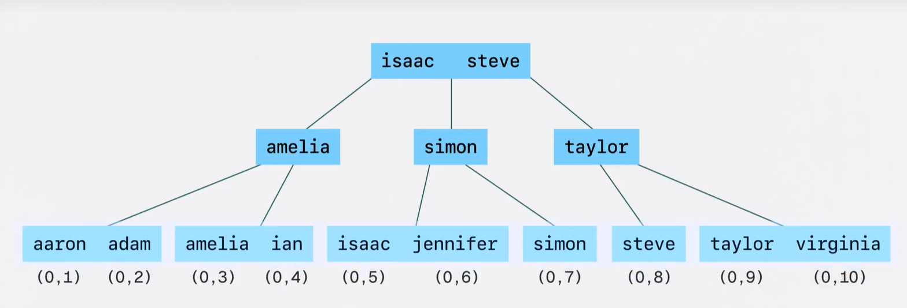
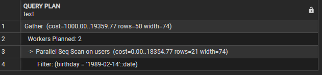
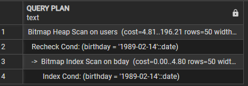

- in psql command line
    - \l -> list all the datatabase
    - \c NewDb -> switch databases

-- 31. Text search type
create table ts_example (
	id bigint generated always as identity primary key,
	content text,
	search_verctor_en tsvector generated always as (to_tsvector('english', content)) stored
)
insert into ts_example (content) values ('The quick brown fox jumps over the lazy dog')
insert into ts_example (content) values ('The quick brown fox jumps over the cat')
select * from ts_example where search_verctor_en @@ to_tsquery('cat')


-- 32. Bit string
select b'0101' & B'0001'  -- bit mask
create table bits_example (
	bit3 bit(3),
	bitv bit varying(32)
)
insert into bits_example (bit3, bitv) values ('011', '01010100011101')
insert into bits_example (bit3, bitv) values (b'101', b'0101010001')
select * from bits_example


-- 33. Ranges
select '[1, 5]'::int4range   -- [1, 6) 6 exclusive
-- int range has discrete steps
-- 1, 2, 3, 4, 5
-- date range has discrete steps, day by day

select '[1, 5]'::numrange  -- [1, 5] 5 inclusive
-- num range is continuous, no discrete step
-- the number is infinity, like:
-- 1, 1.0000000000001, 1.000000000002 ...
-- timestamp functionally the same thing

select numrange(1, 5, '(]');

CREATE TABLE range_example (
	id BIGINT GENERATED ALWAYS AS IDENTITY PRIMARY KEY,
	int_range INT4RANGE,
	num_range NUMRANGE,
	date_range DATERANGE,
	ts_range TSRANGE
)

INSERT INTO range_example (int_range, num_range, date_range, ts_range)
VALUES
('[1,11)'::int4range, '[0.5,5.5)'::numrange, '[2023-01-01,2024-01-01)'::daterange, '["2023-09-01 00:00:00","2023-09-30 23:59:00"]'::tsrange),
('[2,101)'::int4range, '(0.0,10.0]'::numrange, '[2022-01-01,2022-06-01)'::daterange, '("2023-01-01 00:00:00","2023-01-10 12:00:00"]'::tsrange),
('[10,20)'::int4range, '[1.0,2.0)'::numrange, 'empty'::daterange, 'empty'::tsrange),
('[5,)'::int4range, '[1.0,)'::numrange, '(,)'::daterange, '(,"2023-01-01 00:00:00")'::tsrange);
select * from range_example

-- '@>' check if a range contains a value
select * from range_example where int_range @> 5

-- check if two range overlap, '&&'
select * from range_example where int_range && '[20, 22]'

-- intersection of 2 ranges
select int4range(10, 20) * int4range(15, 25)
select int4range(10, 20, '[]') * int4range(15, 25)
-- inclusive, exclusive, continous range, discrete range

-- upper / lower
select upper(int4range(10, 20, '[]')), upper_inc(int4range(10, 20, '[]'))

-- multi-range
select '{[3, 7), [8, 9)}'::int4multirange @> 7


-- 34. Composite types
create type address as (
	number text,
	street text, 
	city text,
	state text,
	postal text
);
select row('123', 'Main St', 'Anytown', 'ST', '12345')::address    -- can do without 'row'

create table addresses (
	id bigint generated always as identity primary key,
	addr address
)
insert into addresses (addr) values(('123', 'Main St', 'Anytown', 'ST', '12345'))

select id, (addr).street from addresses -- paranthesis is must


-- 35. Nulls
-- you will get a lot good thing from restrain the column not nullable, like indexing, grouping, comparing, sorting etc.
create table products (
	id bigint generated always as identity primary key,
	name text not null,
	price numeric not null check(price > 0)
)
insert into products (name, price) values ('chest', '20.4234')
insert into products (name, price) values ('majiang', 0)
select * from products
drop table products


-- 36. Unique constraints
-- Primary key auto add not null and unique
-- can insert null into uqniue column
-- allow null but not distinct, you only allow 1 null in the column
-- Unique can be used for the combination of the columns, used as talbe constraint


-- 37. Exclusion constraint
-- GIST: a type of index
-- && is overlap check, if it's overlap then excluded
CREATE TABLE reservations (
	id BIGINT GENERATED ALWAYS AS IDENTITY PRIMARY KEY,
	room_id INTEGER,
	reservation_period TSRANGE,
	EXCLUDE USING GIST (reservation_period WITH &&)
)

INSERT INTO reservations (room_id, reservation_period) VALUES (1, '[2023-09-01 14:00, 2023-09-03 12:00)');
select * from reservations

-- but if someone want to book to another room, it still cannot book, since the overlap exclusion constrain
INSERT INTO reservations (room_id, reservation_period) VALUES (2, '[2023-09-02 14:00, 2023-09-04 12:00)');

drop table reservations
-- we need to check the room in the exclusion constrain as well 
CREATE TABLE reservations (
	id BIGINT GENERATED ALWAYS AS IDENTITY PRIMARY KEY,
	room_id INTEGER,
	reservation_period TSRANGE,
	EXCLUDE USING GIST (room_id WITH =, reservation_period WITH &&)
);

-- but the gist doesn't have the default = operation for integer, we need to enable the btree_gist
-- after enable the btree_gist, we can run the create table again.
CREATE EXTENSION IF NOT EXISTS btree_gist;

INSERT INTO reservations (room_id, reservation_period) VALUES (1, '[2023-09-01 14:00, 2023-09-03 12:00)');
INSERT INTO reservations (room_id, reservation_period) VALUES (2, '[2023-09-02 14:00, 2023-09-04 12:00)');
INSERT INTO reservations (room_id, reservation_period) VALUES (2, '[2023-09-01 14:00, 2023-09-04 12:00)');


-- Then what if the reservation being cancled? we add a enum in the table, here using text instead, no time to do that :)
drop table reservations;
create table reservations (
	id bigint generated always as identity primary key,
	room_id integer,
	booking_status text,
	reservation_period tsrange,
	exclude using gist (room_id with =, reservation_period with &&)
);

insert into reservations (room_id, booking_status, reservation_period) 
values (1, 'canceled', '[2023-09-01 14:00, 2023-09-03 12:00)');
select * from reservations

-- based on the previous definition, we can't insert a confrimed book record, even the previous one canceled
insert into reservations (room_id, booking_status, reservation_period) 
values (1, 'confirmed', '[2023-09-01 14:00, 2023-09-03 12:00)');

-- we need to re-define the table, add the where constraint to the exclude
drop table reservations;
create table reservations (
	id bigint generated always as identity primary key,
	room_id integer,
	booking_status text,
	reservation_period tsrange,
	exclude using gist (room_id with =, reservation_period with &&) where (booking_status != 'canceled')
);

select * from reservations

-- then try to insert two overlapped records with different booking_status, can only confirm once.
insert into reservations (room_id, booking_status, reservation_period) 
values (1, 'canceled', '[2023-09-01 14:00, 2023-09-03 12:00)');
insert into reservations (room_id, booking_status, reservation_period) 
values (1, 'confirmed', '[2023-09-01 14:00, 2023-09-03 12:00)');


-- 38. Foreign-key constraint
create table states (
	id bigint generated always as identity primary key,
	name text
);
create table cities (
	id bigint generated always as identity primary key,
	state_id bigint references states(id),
	name text
);
insert into states (name) values ('Shaanxi');
select * from states;
insert into cities (state_id, name) values (1, 'xi''an')
select * from cities

-- Or you can define the foreign key on table level,
-- this can also used for composite foreign key
drop table cities;
create table cities (
	id bigint generated always as identity primary key,
	state_id bigint, 
	name text,
	foreign key (state_id) references states(id)   -- on delete no action / restrict / cascade
);
insert into cities(state_id, name) values (1, 'xi''an');

-- difference between no action / restrict? 
	-- no action allow check deferred to later transaction


-- 39. Introduction to indexes
	-- When creating a index for a column, 
	-- it's actually create a separate index table, which including
		-- that column data
		-- and a pointer to point to the physical address of that record
	-- normally it uses b-tree to create for easy traverse and fast lookup
	
	-- So it's better to not create index for every columns of a table, slow down the database
		-- When update the table, the index needs to update as well.


-- 40. Heaps and CTIDs
	-- index contains a pointer point back to the table.
	-- How does postgresql store rows under the hood, how does it write the data to disk?
		-- postgres has a bunch of pages (eaqual size blocks), in the page, there are rows
		-- so, you can easily get the data from page 5 row 8
	
	-- postgres put the data in whereever it can, 
		-- like page5 row8, page10 row2, 
		-- it's a heap, fast to store and lookup
		
select *, ctid from reservations -- where ctid = '(0,4)' 
-- ctid (0, 4), means data in page 0, position 4
-- you can use a where clause for ctid, HOWEVER DON'T, these ctids will change after vaccum the database.

-- Every index contains the ctids, that's the actually pointer to get you back to the table to find the data.

### 41. B-tree overview ###
-- Most common index type
```sql
CREATE TABLE users (
    id INT GENERATED ALWAYS AS IDENTITY PRIMARY KEY,
    name TEXT NOT NULL,
    email TEXT NOT NULL
);

INSERT INTO users (name, email) VALUES
('Aaron','aaron@example.com'),
('Steve','steve@example.com'),
('Jennifer','jennifer@example.com'),
('Simon','simon@example.com'),
('Amelia','amelia@example.com'),
('Isaac','isaac@example.com'),
('Virginia','virginia@example.com'),
('Adam','adam@example.com'),
('Taylor','taylor@example.com'),
('Ian','ian@example.com');

select * from users;
```
-- so the b-tree looks like:

    - All the index in the leaf node
    - leaf nodes have the ctid to point to the original record in database.


### 42. Primary keys vs. secondary indexes ###
- Clustered index
    1. determines the physical order of the row in the table. ❤️
    2. can be only one clustered index per table.
    3. Leaf nodes of the index contain the actual rows.

- mysql / sql server
    - automatically make the primary key the clustered index, but this is a database design choice, not a rule.

- Secondary index
    1. is an additional index, *DO NOT* control the physical order of the table.
    2. leaf stores *index key* + *pointer to the row*
    3. table order no change
    4. a table can have multiple secondary indexes.

| Feature                 | Clustered Index | Secondary Index       |
| ----------------------- | --------------- | --------------------- |
| Physical order of table | Yes             | No                    |
| Number allowed          | 1               | Many                  |
| Leaf nodes store        | Actual rows     | Row pointers          |
| Query speed             | Very fast       | Fast but needs lookup |

- In postgres
    - there's no `true` clustered index by default, all indexes are secondary index.
    - All the data is stored in heap, big old pile.
    - 这个clustered说明了数据在内存中存贮的方式，是连在一起的(mysql/sqlserver)。

- 而postgres，数据在内存中位置是不固定的，所以在postgres里没有clustered index, so all indexes in postgres are secondary indexes.

### 43. Primary key types ###
- What data type should you use for primary key? Integer or UUID ?
    - 98% --> *bigint*
    - When adding new, the id always grows, re-blancing b-tree more easier than inserting random id

- UUID
    - 7 variants of UUID,
        - ULID
        - UUIDV7
            - time ordered UUID.
            - doesn't have the in-efficient re-balance b-tree issue.
    - random UUID will cause b-tree re-balanced and re-structured.

- When should you use UUID
    - size: UUID is 16 bytes
    - Need to generate the id without talking to the database, without coordinate with other parts.
    - use a *time ordered* variant
        - v7 or  ulid

- Security concern about sequenced bigint, since people can guess the id of the item based on the URL etc.
    - people can guess how many user you have, how many invoices you have created, etc.
    - solution:
        - have a public id alongside your bigint primary key.
        - create a secondary key, like a nano id, very compact, very random, impossible guess

### 44. Where to add indexes ###
```sql
    explain select * from users where birthday = '1989-02-14'
```

- Without index it will show Parallel Seq Scan

- Adding the index via
```sql
    create index bday on users using btree(birthday);
```


- if you want to order the column, better to index it
- So the index is using in select, order, group, you can use explain to check in sql

```sql
    -- create new user table
    CREATE TABLE users (
        id BIGINT GENERATED ALWAYS AS IDENTITY PRIMARY KEY,
        first_name TEXT NOT NULL,
        last_name TEXT NOT NULL,
        email TEXT NOT NULL,
        birthday DATE,
        is_pro BOOLEAN DEFAULT FALSE,
        deleted_at TIMESTAMPTZ NULL,
        created_at TIMESTAMPTZ NOT NULL,
        updated_at TIMESTAMPTZ NOT NULL
    );  

    -- generate 989908 rows of records.
    INSERT INTO users (
        first_name,
        last_name,
        email,
        birthday,
        is_pro,
        created_at,
        updated_at
    )
    SELECT
        'User' || g,
        'Test',
        'user' || g || '@example.com',
        DATE '1970-01-01' + (random() * 20000)::int,
        (random() < 0.5),
        now() - (random() * interval '2000 days'),
        now() - (random() * interval '1000 days')
    FROM generate_series(1, 989908) AS g;   

    explain select * from users where birthday = '1989-02-14'
    explain select * from users where birthday between '1989-01-01' and '1989-12-31'
    create index bday on users using btree(birthday);
    explain select count(*), birthday from users group by birthday;
```

### 45. Index selectivity ###
- two criteria to decide if the column is a good candidate for index
    1. *cardinality*
        - Number of discrete or distinct values in the column
        - e.g.: a column with boolean value, the cardinality is 2, (true/false), only can have two distinct values

    2. *selectivity*
        - ratio 
        - How many distinct values are there as a percentage of the total number of rows in the table.
        - If a boolean column only have two rows data(one is true, another is false), then the selectivity is 100%, select once can get the value we want.
        - The closer we get to one, the better we get
- So the `is_pro` column is boolean, which has the selectivity is pretty low "0.000002020389773595121971"
    - Question:
        - In what scenario, indexing a boolean column is good/bad?

```sql
    select 
    	(count(distinct birthday)/count(*)::decimal)::decimal(7, 4)
    from users;
    
    -- selectivity closer to 1, better
    select 
    	(count(id)/count(*)::decimal)::decimal(7, 4)
    from users;
    select 
    	count(distinct is_pro)/count(*)::decimal
    from users;
    
    select count(*) filter(where is_pro is true) from users;
    -- When the data is not skewed, like true/false is distributed in this table, the selectivity even better than birthday
    select 
    	(count(*) filter(where is_pro is true)/count(*)::decimal)::decimal(7, 4)
    from users;
    
    -- this is using index scan (why)
    explain select * from users where birthday < '1989-02-14'
    select count(*) from users where birthday < '1989-02-14'  --345k
    -- answer: this results get less than half of the table, postgres decide to use the index.
    
    -- this one using Seqence scan (why)
    explain select * from users where birthday > '1989-02-14'
    select count(*) from users where birthday > '1989-02-14' --643k
    -- So in here, the index doesn't assist us more, since the result is more than half of the table rows.
    -- Postgresql will decide if the index is not eliminate enough rows, it just goes straight to table
    
    -- postgres keep these data under the hood, can be updated by running analyse table or auto vaccume, not get it real-time.
```

### 46. Composite range ###
- Rules
    - Left most prefix rule:
        - Left to right no skipping
        - stops at the 1st range

- So most common condition should go to the MOST LEFT side when defining index
```sql
    create index multi on users using btree (first_name, last_name, birthday);
    explain select * from users where last_name = 'Francis';     -- this is not using the newly created index her

    -- because we declare our composite index first_name first, then last_name, then birthday, ORDER MATTERS
    -- This is left most prefix rule.

    explain select * from users where first_name='eric';    -- this is using the index

    -- this one skipping the last_name, but still using index to scan, because postgres do the optimization.
    -- index scan the first_name then seq scan the birthday
    explain select * from users where first_name='allen' and birthday='1989-02-14'

    -- if we create a new multi index only for first_name and birthday
    create index multi2 on users using btree(first_name, birthday);

    -- then we can notice that the multi2 index is being used for only first_name and birthday filter
    explain select * from users where first_name='allen' and birthday='1989-02-14'

    -- So most common condition should go to the MOST LEFT side when defining index
```

### 47. Composite range ###
- You want your index from left to right
    - *LEFT <-- most commonly used -- strict equality -- range --> RIGHT*
    - If you skip a column or encounter the range, database starts scanning, 
    - postgres sometimes has optimized a bit.

```sql
    -- create two different indexes
    create index first_last_birth on users using btree(first_name, last_name, birthday);
    create index first_birth_last on users using btree(first_name, birthday, last_name);

    -- It will pick the one which most efficient.
    explain select * from users where first_name='User123' and last_name='Test' and birthday < '2005-02-14';
    explain select * from users where first_name='User123' and birthday < '2005-02-14' and last_name='Test'
```

### 48. Combining multiple indexes ###
- When we have two columns have index respectively, and create a combined index including these two columns
    - postgres will decide which index will be use.
    - base on your data, your scenario, you need to test it out to know exactly which index it's gonna use.
- Normally
    - When you *and* a filter, it will use the combined index.
    - When you *or* a filter, it will use the individual one and use BitmapOr to combine the result. (I didn't see the BitmapAnd / BitmapOr, maybe the dataset I have a bit different)

```sql
    create index "first" on users using btree(first_name);
    create index "last" on users using btree(last_name);

    -- if combined index not create, use first index
    explain select * from users where first_name = 'User1323' and last_name='Test';
    explain select * from users where first_name = 'User1323' or last_name='Test';

    create index first_last_index on users using btree(first_name, last_name);

    -- first_last_index
    explain select * from users where first_name = 'User1323' and last_name='Test';

    -- seq scan
    explain select * from users where first_name = 'User1323' or last_name='Test';
```

### 49. Covering indexes ###
- no need to go back to heap to grab all the data, all the indexes already have these data and return directly
- The created multi index *indludes* all the data we want to query.

```sql
    -- check all the indexes for specific table
    select * from pg_indexes where tablename='users';

    -- Generate the drop index statements, except the primary key constraint
    SELECT
        'DROP INDEX IF EXISTS ' || schemaname || '.' || indexname || ';'
    FROM pg_indexes
    WHERE tablename = 'users'
    AND indexname NOT LIKE '%_pkey';
```

```sql
    -- (1) shorthand syntax
    create index "first" on users(first_name);
    -- index scan
    explain select * from users where first_name='User1231';
    -- index only scan
    explain select first_name from users where first_name='User1231';

    -- (2) combined index
    drop index "first";
    create index "first_last" on users(first_name, last_name);
    -- index only scan
    explain select first_name from users where first_name='User13223';
    explain select first_name, last_name from users where first_name='User13223';
    -- index scan
    explain select id from users where first_name='User13223';

    -- (3) including other info
    drop index "first_last";
    create index "multi" on users(first_name, last_name) include (id);
    -- index only scan, since the leaf nodes in btree including the id info.
    explain select first_name, last_name, id from users where first_name='User13223';

    -- don't shove a bunch of data in these, especially large column, e.g. json
    -- because you gonna blow up your btree, you basically recreate your table.
```

### 50. Partial (unique) indexes ###
- if your data distribution is highly skewed, we can create a partial index for that part, if we filter that part a lot and want faster
- e.g.
    - Adding the index to email column only when is_pro is true
- *key part*
    - you need to include the partial index predicate in your queries

```sql
    create index email on users(email) where is_pro is true;

    -- not using the index, seq scan
    explain select * from users where email='user126323@example.com';

    -- index scan, need to match the predicate in the partial index
    explain select * from users where email='user126323@example.com' and is_pro is true;

    -- but still not work when the predicate different
    explain select * from users where email='user126323@example.com' and is_pro is false;

    -- Modify the 1st user to have the same email, and add a Now in the delete_at column
    select * from users where email='user126323@example.com'

    drop index email
    -- create the unique partial index
    create unique index email on users(email) where deleted_at is null;
```

### 51. Indexing ordering ###
- Creating the index, especially composite index, in the order you want to read it
```sql
    select * from pg_indexes where tablename='users';
    drop index multi;
    drop index email;
    create index created_at on users(created_at);

    -- index scan
    explain select * from users order by created_at limit 10;
    -- index scan backward, postgres provide
    explain select * from users order by created_at desc limit 10;

    create index birthday_created_at on users(birthday, created_at);

    -- index scan
    explain select * from users order by birthday, created_at limit 10;
    -- index scan backward
    explain select * from users order by birthday desc, created_at desc limit 10;

    -- twist, one desc, one asc, then incremental sort, not using index anymore
    explain select * from users order by birthday desc, created_at asc limit 10;
    explain select * from users order by birthday asc, created_at desc limit 10;

    -- But if you create your index in different orders
    drop index birthday_created_at;
    create index birthday_created_at on users(birthday asc, created_at desc);
    -- index scan, since the index defined like that.
    explain select * from users order by birthday asc, created_at desc limit 10;
    -- Also you can twist the order, then it will become Index Scan Backward
    explain select * from users order by birthday desc, created_at asc limit 10;

    -- If you use it not like defined, you back to the Incremental Sort again.
    explain select * from users order by birthday asc, created_at asc limit 10;
```

### 52. Ordering nulls in indexes ###
- If you find yourself reaching for *nulls first* or *nulls last* in the query, relatively often, you might consider to create a index to represent that same exact order.
```sql
    select * from users limit 10;
    select * from users where birthday is null;

    -- null is the biggest by default
    select * from users order by birthday desc limit 10;

    -- change it explicitly
    -- no index, Parallel Seq Scan
    explain select * from users order by birthday desc nulls last limit 10;
    explain select * from users order by birthday asc nulls first limit 10;

    -- create a index
    create index birthday_null_first on users(birthday ASC NULLS FIRST);

    -- Then after index created, index scan, both of them
    explain select * from users order by birthday asc nulls first limit 10;
    -- Index Scan Backward
    explain select * from users order by birthday desc nulls last limit 10;

    -- Even these two are Index Scan
    -- Index Scan
    explain select * from users order by birthday asc nulls last limit 10;
    -- Index Scan Backward
    explain select * from users order by birthday desc nulls first limit 10;
```

### 53. Functional indexes ###
```sql
    select email, split_part(email, '@', 2) from users limit 10;

    -- Create index for function, remember to use extra ()
    create index domain on users((split_part(email, '@', 2)));

    -- using Index Scan
    explain select * from users where split_part(email, '@', 2) = 'tech.dev' limit 10;

    create index lower_email on users((lower(email)));
    -- Parallel Seq Scan
    explain select * from users where email='charles.ramirez485@gmail.com';
    -- Bitmap Index Scan
    explain select * from users where lower(email)='charles.ramirez485@gmail.com';
```

### 54. Duplicate indexes ###
- You have a index like
```sql
    create index email on users (email);
```

- And along with business change, you decide to add a new one with email and is_pro
```sql
    create index email_is_pro on users (email, is_pro);
```

- In this case, the second one `email_is_pro` can safely replace the first one `email`, since left most rule.
- The first one can safely deleted.

### 55. Hash indexes ###
- Hash indexes is only use for *strictly equality lookups*
- Prior postgre 10, *DO NOT* use this.
```sql
    create index email_btree on users using btree(email);
    create index email_hash on users using hash(email);

    -- Index Scan using email_hash, faster than btree
    explain select * from users where email='paul.brown353520@mail.com';

    -- Parallel Seq Scan
    explain select * from users where email like 'paul.brown35%';
```