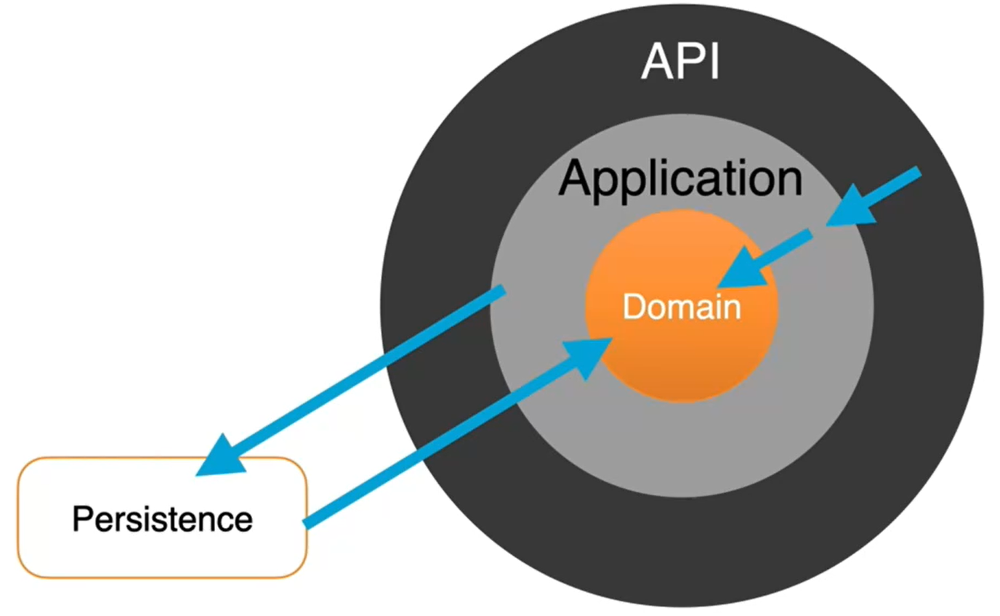
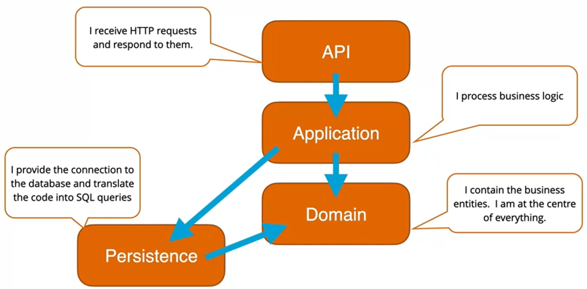

## Section 2 - Building a walking skeleton Part 1 - .Net API ##
- Domain is the center of the application and has no dependency on other parts.
 

- dotnet CLI
  - `dotnet --info`
  - `dotnet new list`
    - `dotnet new sln`
      - Will create the sln container based on the directory name we're now at.
    - `dotnet new webapi -n NAME -controllers`
    - `dotnet new classlib -n DOMAIN`
    - `dotnet sln add DOMAIN`

  - `dotnet watch`
    - hot reload the changes, but not always applied
  
  - launchSettings.json
    - decide which port to launch the project.
    - we can remove the http one, since we gonna use the https in production.
  
  - When chrome doesn't trust the localhost development certificates. ***Not Secure***
    - `dotnet dev-certs https --check`
      - see if there's a valid certificate
    - `dotnet dev-certs https --help`
    - `dotnet dev-certs https --clean`
      - to clean the non-valid certificate
    - `dotnet dev-certs https --trust`
      - trust the existing certificate
    - restart the browser to validate it.