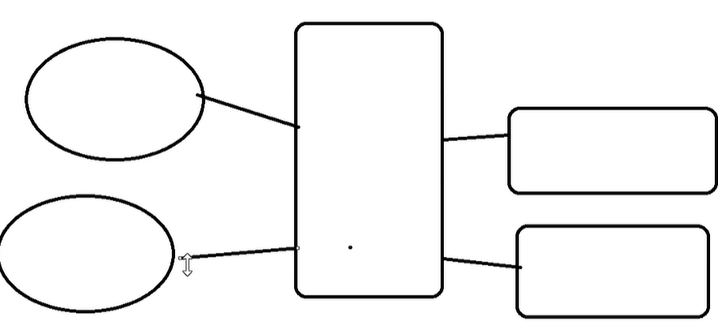
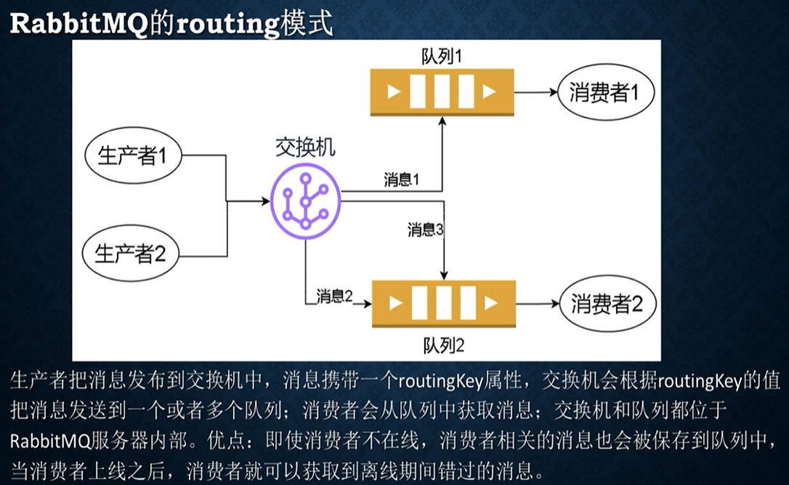
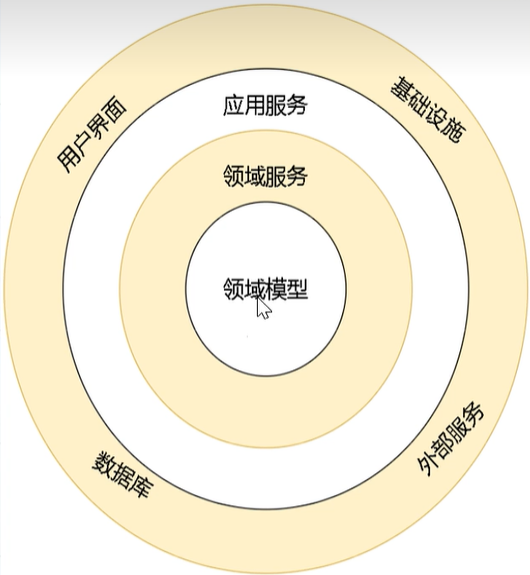

### Project Code ###
  - https://github.com/yangzhongke/NETBookMaterials

### Check the location of FileStream in different Assembly (.net framework, .net core, .net standard) ####
  - typeof(FileStream).Assemble.Location

### 反编译工具 ### 

- ILSpy
- 反编译后，知道 async await 是被编译器拆分成一个个小部分，在 switch 语句中调用。

ThreadPool.QueueUserWorkItem 在线程池执行

查看异步运行前后的线程 Id, 如果异步程序运行时长，线程很有可能切换。之前的线程返回线程池，异步完成后，分配新的线程 from threadpool。

### Occam's Razor ###
- 如无必要，勿增实体

Self-defined ```IConfigReader``` contain ```IEnumerable<IConfigService> configServices```
- Based on the register order to get the configured values, like environment first, config file second.
- If there's no enviorment variable then getting into the config file to get the value.
- If both of them don't have, then reture null.

### Configuration reading: ###
1. Configuration settings, required namespaces 
    - Microsoft.Extensions.Configuratin
    - Microsoft.Extensions.Configuration.Json
```c#
    var configBuilder = new ConfigurationBuilder();
    configBuilder.AddJson(...)

    var config = configBuilder.Build();
    config["name"]
    config.Get<T>()
```

2. Option pattern for configuration, required namespaces
    - Microsoft.Extensions.Configuration
    - Microsoft.Extensions.Configuration.Json
    - Microsoft.Extensions.Options
    - Microsoft.Extensions.Configuration.Binder - 把配置项绑定成类
  
3. How to use with DI.
    - IOptions<T>,
    - IOptionsMonitor<T>,
    - IOptionsSnapshot<T> （同一范围内保持一致，例如 asp.net 的一个 request 里）， Recommended

4. How to 自己写 `confinguration provider`.
   1. create 自己的 provider, 继承 `IConfigurationProvider` OR `FileConfigurationProvider`, 实现 `Load` 方法，从 XML 文件/数据库/JSON 里读取 config file value, 然后将*扁平化*处理 *XXX：YYY:ids:1* 的数据存贮在 Dictionary<string, string> 里，然后赋值 provider 的 Data property.
   2. create 自己的 source, 继承 `IConfigurationSource` OR `FileConfigurationSource`, 实现 `Build` 方法，确定调用 `EnsureDefault(builder)`, 然后 return new SelfCreatedConfigProvider(this) // this 就是 source 自身.
   3. 用的时候把配置文件路径传进去就可以了。
   4. 可以用 `IOptionsSnapshot<XXXConfig>` 来验证。 XXXConfig 就是自定应的类，映射配置文件的格式。

### Logging ###
1. console log, event viewer, Nlog,
2. 集群结构化 log 信息， .net 给 NLog --> Serilog --> Exceptionless.
3. ELK (Elastic Search, Logging, Kibana)
- 普通项目，没有集群, NLog 搞定
- Serilog(机构化日志) + 集群部署(exceptionless)

### 要清楚每个东西的优缺点，如何选择技术方案。 ###
>- 重要的是设计解决方案的能力, 在各种各样的产品中，根据项目的需求，选择一套解决方案。
>- 要明白各个产品的应用场景，明白产品优缺点，明白公司现状，从而在这些纷杂（乱七八糟）的产品中选择一套解决方案，适合公司，适合开发，成本又低，这才是程序员努力方向，才能做到越老越值钱。

### EFCore ###

- 什么是唯一索引，什么是聚合索引， IsUnique(), IsClustered()

- 聚合索引的特点
  - 顺序存贮

- GUID 做主键
  - 不能设置成聚集索引（cluster index）， 因为不连续，
  - 如果设置成聚集索引，那每次插入的时候，它都要重新排序（按照 GUID），效率非常低。

- SQLServer NewSequentialId()是可以生成连续的 GUID
  - 但也不能解决问题，存到数据库里不一定是连续的。
  - 所以，在插入的时候很可能要重新排序（如果设置了 cluster index），所以效率低

- Cluster Index: 
  - 保证主键有序，范围查询。
  - 二分查询，提高索引效率。
  - 所以要一直保持索引有序。

- GUID
  - 优点： 高并发插入数据，不重复。
  - 缺点： 占空间，不连续，cluster index 效率低。

- 自增
  - 缺点： 并发插入效率低。

所以 =>

- 在 SQLServer 等数据库中，不要把 GUID 主键设置为 cluster index

- 在 MySQL 中，插入频繁的表不要用 GUID 做主键。

- 另一种解决方案：混合自增和 GUID，自增作为物理主键，GUID 作为逻辑主键

- Hi/Lo 算法

### Migration Command ###
- Update-Database XXX
- Remove-Migration
- Script-Migration: 
  - 用于生产环境，可以指定生成从一个 migration 到另一个 migration 的脚本，数据库可以直接运行。
  - script-migration FROM TO

### 自引用的组织结构树 ###
一对多
  - 最简单
  - 一端的 entity 包含 多端的 List, 多端的 entity 包含一端的 entity
  - 外键可以根据需要来加，也可以不加。

一对一
  - 需要一端方加一个外键，这样 EFCore 才能推断出。

多对多
  - 两边加 List, configuration 其中一方，
  - ```HasMany<Teacher>(s => s.Teachers).WithMany(t => t.Students).UsingEntity(j => j.ToTable("Students_Teachers"))```

总结：
  - HasXXX().WithXXX()
  - HasOne().WithMany()
  - HasMany().WithOne()
  - HasMany().WithMany()
  
### IQueryable VS IEnumerable ###
  - IQueryable 生成的 SQL 语句会apply filter, substring etc., 会在服务器端传递数据之前，执行的 SQL 语句, 已经过滤调了不需要的 items.
  - IEnumerable 是把所有的数据拉回到程序内存里在做 filter, substring, etc.
  - Where, Select, etc. 等 Linq 语法，都有对应的 IQueryable 和 IEnumerable 两个版本
  - 可以强制转换成 IEnumerable，把数据先拉回程序中，再进行一些复杂操作。（如果用 IQueryable 生成的 SQL 太复杂反而性能降低）
  - 也可以利用 ToArray(), ToList(), 把 IQueryable 的结果一次加载到内存中，就行了。

### ADO.NET两种读取数据方式 ###
  1. DataReader - 从数据库分批读取，内存占用小，DB 链接占用时间长
  2. DataTable - 一次性读取数据，加载到内存，内存占用大，节省 DB 链接

### SQLServer connection string, `MultipleActiveResultSet`=true ###
  - 设置数据库支持多个 DataReader 同时读取。
  - EFCore 本质上就是调用 ADO.NET，IQueryable 就是调用 DataReader, 原则上是不支持多个 DataReader 同时执行.
  - 但是在 SQLServer connection string 中加上这个设置就可以了。

### Interpolation ###
  - 赋值给 string， 字符串拼接， "insert into " + "T_Articles" + .....
  - 赋值给 FormattableString， 编译器构造 FormattableString 对象，避免 SQL 注入
```sql
FormattableString sql =
@"Insert into T_Articles(Title, Message, Price)
  select Title, {name}, Price
  from T_Articles
  where Price > 10"
```

### 解决 SQL 注入最好的方法就是参数化查询 ###

### 直接执行 sql 语句，非查询语句 ###
  - `ctx.Database.ExecuteSqlInterpolatedAsync`
  - 之前用 `ExecuteSqlRaw()`， 需要自己设置参数，有注入风险，不推荐了

### 与实体（entity）相关 ###
  - `FromSqlInterpolated` 只支持单表查询，不可以 join， 包含所有的列
  - `ctx.Books.FromSqlInterpolated(@$"select * from T_Books where DataPart(year, PubTime) > {year} order by newid()")`

### 执行任意 SQL ###
```C#
ctx.Database.GetDbConnection()获得 ADO.NET core 的数据库链接对象。
DbConnection conn = ctx.Database.GetDbConnection();
if (conn.State != ConnectionState.Open)
{
  conn.Open();
}

using (var cmd = conn.CreateCommand())
{
  cmd.CommandText = @"xxxx e.g.: select Price, Count(*) from T_Articles group by Price";
  var pl = cmd.CreateParameter();
  pl.ParameterName = "@year";
  pl.Value = year;
  cmd.Parameters.Add(pl);
  using（var reader = cmd.ExecuteReader())
}
```

没有用 `FromSqlInterpolated`，是因为不想创建过多的实体（entity）类，并不需要在数据库中存储数据，可能只需要一个映射的类，但是导致 dbSet 膨胀。
可以用 dapper 来操作，自动映射 raw sql 查询结果到类,并不是实体类，不用放入 dbContext

DbContext Entry(object) 得到 `EntityEntry`, EFCore 靠它跟踪对象。 `EntityEntry.State` 可以得到 entity 的状态， DebugView.LongView 可以看到实体变化信息。

### 全局筛选器 ###
  - 在 config entity 的时候加入条件，e.g. In `ArticleConfig : IEntityTypeConfiguration<Article>` 中的 `Configure` 方法中，`builder.HasQueryFilter(a => a.IsDeleted == false)`
  - 如果想 ignore 全局筛选器， 在做 filter 的时候需要显示表明 IgnoreQueryFilters()
```c#
   foreach (var a in ctx.Articles.IgnoreQueryFilters().Where(a => a.IdDeleted))
   {
   }
```

### 应用的地方 ###

   - 软删除
   - 多租户

有可能的问题
  - 性能下降，例如索引失效。

### 并发控制 ###
  - 避免多个用户同时操作资源造成并发冲突，例如两个用户同时点赞，有可能点赞丢失。
  - 问题：
      - 脏写：一个事务覆盖了另一个还没提交的修改；
      - 丢失更新：后提交的事务把先提交的更新覆盖掉。

  - 解决:
      - 数据库层面，两种策略：
          - 悲观（Pessimistic Locking） - 总认为会有冲突，加锁。 需要开发人员便携原生SQL语句，不同数据库语法不同。行锁，表锁
          ```SQL:
            select * from T_Houses where Id = 1 for update  // 这个for update就是行锁
          ```
            需要包含在transaction中，
          ```sql
            BeginTransactionAsync()
              // 执行MySQL的raw sql，需要调用来 update operation
              ctx.Houses.FromSqlInterpolated($"select * from T_Houses where Id=1 for update").SingleAsync();
            CommitAsync()
          ```

          - 优点：
            - 简单
          - 缺点：
            - 锁是独占的，排他的，如果并发量大，会严重影响性能，如果使用不当，导致死锁。
            - 不同数据库，语法不一样。

          - 使用场景：
            - 简单系统，访问量不大，就可以用这个悲观并发控制

        - 乐观（Optimistic Locking）- 并发令牌， EFCore提供, recommended.
          - 一个列的情况：
            - 原理：
              - update语句不仅有check id, 还要加上要修改的列(tom 执行)：
                ```sql
                 update T_Houses set Owner='tom' where Id=1 and Owner=""
                ```

              - (jerry执行)：
                ```sql
                  update T_houses set Owner='jerry' where Id=1 and Owner=""
                ```
              
              - Tom 的语句影响的行数为1，因为先执行的。
              - Jerry 影响的行数为0，因为执行的时候Owner已经不为空了，所以执行失败，影响行数为0，EFCore抛出异常 `DbUpdateConcurrencyException`
                ```c#
                  var owner = ex.Entries.First().GetDatabaseValues().GetValue<string>(nameof(House.Owner));
                  Console.WriteLine($"并发冲突，房子已经被{owner}提前抢走了");
                ```

            - 实现：
              - 在table configuration 时表明哪一列为并发toke： 
                ```c#
                  builder.Property(h => h.Owner).IsConcurrencyToken();
                ```
            
            - 问题（缺点）：
              - ABA问题
                - 我拿到 A, 别人改成 B, 另一个人又改成 A, 我就认为这个值没有改变。 
                - 如果本来需求如此，改了之后又改回来就认为没有改，而且只有一列作为并发token，可以考虑用这个IsConcurrencyToken
                - 除此之外，用下面的*RowVersion*应该是更好是选择。

          - 多个列的情况：
            - SQL Server
            ```SQL
              Add a byte[] RowVersion for the entity, then in table configuration, builder.Property(x => x.RowVersion).IsRowVersion();
            ```

            - 其他数据库：
              - 目前还没有支持这种Row Version, MySql 用 timestamp，但是低版本精度不够，不能保证两次操作一定能 update timestamp.
            
            - 解决方法：
                - 手动加一个GUID列，用这个GUID列作为并发token, 但是每次修改其他值的同时，需要手动 update 这个 GUID 
                ```c#
                  h1.RowVer = Guid.NewGuid();
                ```

          - 优点
            - 没有锁，更不会死锁了

### 表达式树 （Exprssion Tree）###
  - 官方定义： 树形数据结构表示代码，可以在运行时访问逻辑运算结构
  - 把 lambda 表达式用表达式树来表示，编译器可以把表达式树（expression tree）翻译成 AST （Abstract Syntax Tree），从而进一步生成更优化的SQL语句。
  - 可以通过debug查看expression tree的结构，left tree, right tree, root etc.

  - `book => book.Price > 5;` 编译器会把这个表达式翻译成下面的expression tree.
  ```
                >
              /  \
             /    \
            .      5
           / \
          /   \
        book  Price     
  ```
  e.g.
  ```c#
      Expression<Func<Book, bool>> e1 = book => book.Price > 5;
      Expression<Func<Book, Book, double>> e2 = (book1, book2) => book1.Price + book2.Price;

      Func<Book, bool> f1 = book => book.Price > 5;
      Func<Book, Book, double> f2 = (book1, book2) => book1.Price + book2.Price;

      using (var ctx = new MyDbContext())
      {
          var books = ctx.Books.Where(e1).ToArray();
      }
  ```
 - Generated SQL statement:
    - when using e1, below is generated SQL:
    ```sql  
        SELECT [t].[Id], [t].[Author], [t].[Price], [t].[Title] FROM [T_Books] AS [t] WHERE [t].[Price] > 5.0E0
    ```
    - when using f1
    ```sql
        SELECT [t].[Id], [t].[Author], [t].[Price], [t].[Title] FROM [T_Books] AS [t]
    ```

### How to check generated expression tree in code: ###
  - Install-Package ExpressionTreeToString
    ```c#
      e1.ToString("Object notation", "C#"); // case-sensitive
    ```

### Asp.Net Core REST 落地 ###
1. RPC 风格： Users/AddNew, Users/GetAll, Users/DeleteById
2. 可以cache的操作，GET。 Idempotent update 使用 PUT。Idempotent Delete => DELETE. 其他操作 POST.
3. POST相对来说比较安全，因为 not idempotent 网关不会重试，保守一些。
3. 业务错误，返回合适的4XX, 报文体返回详细信息

### 实现方式 （简单，快速，好用）： ###
1. Add [action] annotation for Controller class, 优先根据路径匹配, RPC 风格
```c#
  [Route("[controller]/[action]")]
  public class WeatherForecastController : ControllerBase {}
```
2. 不同操作，不同方法名
3. 加[HttpGet], [HttpPost], [HttpDelete], [HttpPut]到对应的方法上

### Action 方法 ###
1. 可以同步也可异步
2. 异步Action方法一般不需要Async结尾，平台调用
3. Action方法返回类型为普通类型 （例如自定义的Person类），返回结果默认为serialized Json
4. 也可以返回 ActionResult<T>, 支持implicit conversion, 可以返回int, 也可以返回NotFound("id不存在");

### 前端 Vue ###
1. 安装Node.js
2. 国内的话，需要npm镜像
3. 安装yarn: npm install -g yarn
4. 创建Vue项目: yarn create @vitejs/app ProjectName

### 注册一个比较耗资源（耗时间）的服务，可以用`builder.Services`注册，然后在对应的方法中调用，不需要构造函数注册。
  - 否则在使用其他方法时，DI也会调用并初始化需要使用的服务，从而浪费资源，我们可以在使用的方法中加入参数名的annotation
```c#
  public int Test([FromServices]TestService testService, int x)
  {
    return testService.Count; // 扫描一个目录，显示文件个数
  }
```

>### drum up ###
> *drum up (something)* also *drum (something) up* 
> - to get or create (support, business, etc.) through hard work and a lot of effort
> - to try hard to get support or business
> - 竭力争取（支持）； 兜揽（生意）
> - They sent out flyers to drum up support for their candidate.
> - He had flown to the north of the country to drum up support for the campaign.


### Part4-22 各项目自己注册DI ###
- 问题：
  - 如果需要 DI 注册， 那其他项目里的服务就要全部被 `program.cs` 所在的项目引用，然后调用 `builder.Services.AddScope<Class123>();`

- 解决：
  - 利用作者这个包可以每个项目自己注册需要的服务。
  - https://github.com/yangzhongke/NETBookMaterials/tree/main/%E6%9C%80%E5%90%8E%E5%A4%A7%E9%A1%B9%E7%9B%AE%E4%BB%A3%E7%A0%81/YouZack-VNext/Zack.Commons

- 要能做到会用，而且懂原理，如何实现
  - 反射 reflection
  - Extension method

### Part4-23~31 缓存 ###
- 概念
  - 缓存命中, hit
  - 缓存命中率, ratio
  - 缓存数据不一致, invalid
  - 多级缓存

- 客户端响应缓存 (app / browser)
  - RFC7324 http 协议
  - cache-control
    - 服务器如果返回 cache-control:max-age=60,
      - 表示服务器指示客户端 **可以** 缓存这个相应60秒。客户端**可以**选择不
  
  - 实现
  ```c#
    public class TestController : ControllerBase
    {
      [ResponseCache(Duration=20)]    // This is the attribute to use for setting the cache
      [HttpGet]
      pubic DateTime Now()
      {
        return DateTime.Now;
      }
    }
  ```

- 服务器端响应缓存，缓存中间件 （鸡肋，不推荐用）
  - 优点：
    - 多个客户端可以利用同一个缓存
  
  - 缺点：
    - 响应状态码为200的GET或者HEAD请求才能被缓存
    - 报文头中不能含有Authorization, Set-Cookie等。
    - 客户端可以通过设置`cache-control: no-cache`来强制服务器不缓存，恶意攻击。

  - 解决：
    - 内存缓存
    - 分布式缓存

  - 实现：
    ```c#
      app.UseCors();

      // 启用服务器端缓存
      // 要在 MapController 之前， UseCors 之后。
      app.UseResponseCaching();  

      app.MapController();
    ```

  -- 测试：
    - 打开两个浏览器，分别get DataTime.Now.
    - 他们拿到的时间时一致的，如果服务器缓存开启。
  

### 当浏览器端设置 ###
  - `cache-control: no-cache`
  - 服务器端无论设置，客户端还是服务器端缓存，均不起作用了。

### 内存缓存 (In-Memory cache) ###
  - 键值对，dictionary
  - 用法：
    1. 启用： `builder.Services.AddMemoryCache()`
    2. 注入 `IMemoryCache` 接口，使用方法：`TryGetValue()`, `Remove()`, `Set()`, `GetOrCreate()`, *`GetOrCreateAsync()`* (highly recommended)

### 缓存的过期时间策略 ###
  - 数据改变的时候调用 `Remove` 或者 `Set` 来删除或者修改缓存。（优点：及时。 缺点：写起来稍微麻烦点，需要在数据都被改动的地方 Remove / Set）
  - 设置过期时间
    - 绝对过期时间
    ```c#
      Book? b = await memoryCache.GetOrCreateAsync("Book" + id, async (e) => {
        Console.WriteLine($"缓存里没找到，到数据库中查一查， id={id}");
        e.AbsoluteExpirationRelativeToNow = TimeSpan.FromSecond(10);    // 设置缓存有效期10秒

        return await MyDbContext.GetByIdAsync(id);
      });

    ```
    - 滑动过期时间 (单独用的情况比较少见)
    ```c#
      // 在指定的时间段内，如果访问了，那缓存被续命了⨀_⨀。
      // 从访问的时间开始，再加指定的时间。
      // 如果没访问，在指定的时间之后，缓存过期。
      e.SlidingExpiration = TimeSpan.FromSeconds(10);
    ``` 

    - 同时设置绝对和滑动
      ```c#
        e.AbsoluteExpirationRelativeToNow = TimeSpan.FromSecond(30);
        e.SlidingExpiration = TimeSpan.FromSeconds(10);
      ```
      - 绝对时间 > 滑动时间
        - 这样缓存会在绝对时间过期之前，随着访问被滑动续期，但是一旦超过绝对时间，缓存项就被删除了。

### 缓存穿透 ###
  - 没有命中缓存，每次都访问数据库
  - 解决方法：
    - 把“查不到”也当成一个数据放入缓存。
    - 用 `GetOrCreateAsync()` 方法即可。

### 缓存雪崩 ###
  - 如果缓存时间设置成5秒，那么缓存项集中过期可能引起缓存雪崩，每隔5秒数据库访问高发，有可能压垮
  - 解决方法：
    - 在基础过期时间上，再加一个随机的过期时间。
    ```c#
      e.AbsoluteExpirationRelativeToNow = TimeSpan.FromSeconds(Random.Shared.Next(10, 15));
    ```
    - 不要用 `new Random().Next()`，因为高频访问的时候有可能生成的随机数时固定的。
    - .NET 6 在`Random` 类里增加了 `Shared` 静态对象，相当于一个全局的，随机的 `Random` 对象。

### 缓存数据混乱 ###
  - 解决方法：
    - 合理设置 `key`

### IEnumerable 陷阱 ###
  - What's the output?
    ```c#
      var items = GetItems();
      Console.WriteLine("Ok");

      foreach (var e in items)
      {
        Console.WriteLine(e);
      }

      IEnumerable<int> GetItems()
      {
        yield return 1;
        yield return 2;
        yield return 3;
        Console.WriteLine("666");
        yield return 4;
        yield return 5;
      }
    ```

  - 输出结果：先打印Ok，再打印 666
    ```console
      Ok
      1
      2
      3
      666
      4
      5
    ```
  
  - 因为 `GetItems()` 并没有直接执行并返回结果。如果加一个 `ToArray()` 就可以直接拿到结果了，会先打印666，再打印Ok。

  - 所以，如果在缓存中如果存储的时 `IQueryable` or `IEnumerable` 就可能存在***延迟***加载的问题。
  - 如果把这两种类型的变量所指向的对象存入缓存，当取出来的时候，如果他们延迟加载时需要的对象(*dbContext*)已经被释放，就会执行失败了。
  - 因此，缓存应禁止使用这两种类型，用 `List` or `Array` etc.

### 分布式缓存 ###
  - 如果系统访问量大。
  - Web服务器非常多。
  - 无法跨集群节点获取缓存，每个服务器需要分别管理自身的缓存。

  - 由于节点数量太多，造成数据库压力非常大，才引用分布式缓存，
  - 一般情况下用内存缓存就挺好，内存缓存效率高，用的简单，部署简单。
  - 除非必要，否则不需要使用分布式缓存。

  - 如何实现，逻辑上一台缓存服务器
  

  - 常用的缓存服务器
    - Redis
    - Memcached
    - .NET 提供了统一的分布式缓存服务器接口 `IDistributedCache`

    |             | 内存缓存    | 分布式缓存 |
    | ----------- |   :---:    |    :---:  |
    | 数据类型     | 没有限制    |   byte[] |
  
  - 用什么？
    - SQLServer，做缓存，性能不好。
    - Memcached
      - 缓存专用，性能好
      - 但是集群，高可用稍弱
      - 缓存健长度需小于250字节
    - Redis (✓)
      - 不局限用于缓存，可以存`list`, `sorted list`, 经纬度 etc.
      - 比Memcached性能稍差
      - 但高可用，并发，集群非常强大。
      - 适合数据量大，高可用性等场合。
      - `.NET` 官方开发了用redis的包
  
  - 如何安装
    - NuGet: `Microsoft.Extensions.Caching.StackExchangeRedis`
    - 注册服务：
      ```c#
        builder.Services.AddStackExchangeRedisCache(opt => {
          opt.Configuration = "localhost";
          opt.InstanceName = "cache1_";        // 前缀，便于区分
        })
      ```
    - 自己封装的
      - https://github.com/yangzhongke/NETBookMaterials/blob/main/%E6%9C%80%E5%90%8E%E5%A4%A7%E9%A1%B9%E7%9B%AE%E4%BB%A3%E7%A0%81/YouZack-VNext/Zack.ASPNETCore/DistributedCacheHelper.cs

### ASP.NET Core与配置系统的集成 ###
- 读取环境变量值
  - In Programs.cs
    ```c#
      Console.WriteLine(app.Environment.EnvironmentName);
      Console.WriteLine(app.Environment.IsDevelopment());
      Console.WriteLine(app.Environment.IsProduction());
    ```

  - In controller
    ```c#
      [HttpGet]
      public string Demo()
      {
        return Environment.GetEnvironmentVariable("haha");
      }
    ```
  - 另一种方法，在controller里，可以在构造函数中注入 `IWebHostEnvironemnt` 就可以了
    ```c#
      public TestController(IWebHostEnvironment webEnv)
      {
        this.webEnv = webEnv;
      }

      [HttpGet]
      public string Demo()
      {
        return webEnv.EnvironmentName;
      }
    ```

### asp.net core 防止机密信息外泄 ###
- ***user secrets***

### Part4-38 ###
- 面向切面变成 (AOP - Aspect-Oriented Programming)
  - 把程序中“横切关注点”(cross-cutting concerns)从业务逻辑中分离出来。
  - 把无关业务逻辑的代码从业务逻辑代码中分离出来，使业务逻辑更清晰。
  - filter 是微软实现的一种，还有AspectCore， PostSharp

- 什么是 cross-cutting concerns
  - 在一个系统中，有些功能不属于莫格具体业务逻辑，但会出现在很多地方：
    - Logging
    - Exception Handling
    - Authorization
    - Performance Monitoring
    - Transaction Management

- AOP的思想就是：
  - 把这些 "cross-cutting concerns" 的逻辑，抽出来单独定义成 ***切面*** (Aspect)，然后用生命的方式（如注解，配置）让它在需要的地方自动执行。
  - 这样业务代码就***更干净***，只关注业务逻辑。

### Part4-40 自动启用transaction的ActionFilter ###
- 数据库的transaction
  - 要么全部成功，要么全部失败。

- EF Core
  - `TransactionScope`
    - transactionScope impelement the IDisposible, 如果TransactionScope的对象没有调用`Complete()`就执行了`Dispose()`，则transaction会被回滚，否则提交。
    - 支持嵌套
      - 只要最外层的transaction回滚了，内嵌的任何transaction即使提交了也会回滚。
  ```c#
    [HttpPost]
    public string Test1()
    {
      using (var tx = new TransactionScope())
      {
        ctx.Books.AddJson(new Book { Name = "aa", Price = 1 });
        ctx.SaveChanges();  // 一个事务(transaction)

        ctx.Persons.Add(new Person { Name = "longNameeeeeee", Age = 18 });      // 设置数据库Person表中Name字段长度为3.
        ctx.SaveChanges());   // 一个事务(transaction)

        tx.Complete();
        return "ok";
      }
    }
  ```

    - 异步代码，创建`TransactionScope`的时候需要传`TransactionScopeAsyncFlowOption.Enabled`

    - 原理keyword: `TransactionScope`, `ThreadLocal`, `AsyncLocal`

- 如果需要在controller的每个`action`方法中都实现`TransactionScope`，就可以用`ActionFilter`来实现
  - https://github.com/yangzhongke/NETBookMaterials/tree/main/%E7%AC%AC%E4%B8%83%E7%AB%A0/%E8%87%AA%E5%8A%A8%E5%90%AF%E7%94%A8%E4%BA%8B%E5%8A%A1%E7%9A%84%E7%AD%9B%E9%80%89%E5%99%A8

- 请求限流器
  - https://github.com/yangzhongke/NETBookMaterials/tree/main/%E7%AC%AC%E4%B8%83%E7%AB%A0/%E8%AF%B7%E6%B1%82%E9%99%90%E6%B5%81%E5%99%A8

### Part4-44 中间件类 ###
- constructor needs to have `RequestDelegate` parameter
  ```c#
    public CheckMiddleware(RequestDelegate next)
    {
      this.next = next;
    }
  ```

- Class needs to have `Invoke` or `InvokeAsync` method, and `HttpContext context` as the parameter, and reture `Task`
```c#
  public async Task InvokeAsync(HttpContext context) { ... }
```

- `Context.Items` can be used for passing through data between middlewares.

### Part4-45 自己手动模仿 Web API 中间件 ###
- https://github.com/yangzhongke/NETBookMaterials/tree/main/%E7%AC%AC%E4%B8%83%E7%AB%A0/MiniWebAPIDemo1

### Part4-46 Markdown 解析器 ###

- 优先使用中间件
- 如果这个组件只是针对MVC或者需要调用一些MVC相关的类的时候，（例如需要得到`controller`的名字，`action`的名字），我们就需要用Filter
- 可以把`filter`理解成MVC中的小中间件

### Multi-thread / Task / Parallel / async, await ###
- 在 dotnet （2025/11/20），99%的时候应该使用 `async/await`, 只有在你需要 `cup-bound`的密集型工作时，才使用`Task.Run`, 而 `Parallel` 用于大批量CPU密集计算。 `Thread` 几乎不用自己创建。

- `async/await`
  - 高并发
  - UI
  - IO-bound
  - 不创建线程，让线程池更高效
  - 开销少，可扩展性高
  - 代码应该默认用`async/await`, 除非你知道自己需要CPU计算

- `Task.Run` 仅用于`CPU-bound`的工作
  - 非IO操作，纯计算。
  - 需要在`Async`方法里，跑一段`CPU-bound`代码
  - 不要用
    - ***不要用 Task.Run 包 IO***
    ```c#
      await Task.Run(() => httpClient.GetStringAsync(url));
    ```

- `Parallel.For / Parallel.ForEach`
  - 百万数据
  - 不需要async
  - CPU-bound且可并行处理

- `Channels / IAsyncEnumerable` （生产者-消费者模型）
  - 高吞吐消息队列
  - 实时数据流
  - 服务端多并发pipeline
  - 替代`BlockingCollection`（已过时）

- 不要主动使用`Thread / ThreadPool / BackgroundWorker`
  - 不够智能
  - 无法自动复用线程
  - 错误处理难
  - 代码复杂

- 不再推荐的旧技术
  - BlockingCollection（用 Channel 替代）
  - Task.Factory.StartNew（用 Task.Run）
  - ContinueWith（用 async/await）
  - Thread.Suspend / Resume（危险）
  - ManualResetEvent / AutoResetEvent（除非底层代码）

## Chapter 5 Identity JWT FluentValidation WebSocket SignalR##

### Chapter 5-1 Asp.net Identity 1 ###
- Authentication vs Authorization
- Identity framework, Role-Based Access Control RBAC
- Three Base classes
  - `IdentityUser<TKey>`
  - `IdentityRole<TKey>`
    - 一般创建继承类，可以省去写的时候每次都带着泛型，麻烦。自定义类，可以通过父类指定这个泛型类型，子类就不需要再写了
    - 可以自定义属性，微信号之类的
  - `IdentityDbContext<User, Role, Key>`
- Install Microsoft.AspNetCore.Identity.EntityFrameworkCore

- IdentityUser<long>
  - long 在SQL中对应 ***BIG INT***

### Chapter 5-2 Identity 2 ###
- Create a controller
- In the action,
  - role manager check if the "admin" role exist
    - if not create
  - user manager check the user with name "yzk" exist
    - if not create
    - then add to the admin role
- 检查用户登录信息
  - 用 User manager find user by name,
    - if not found, fail
  - check if the user has been ***locked***
  - if not locked, check password
  - 可以自定义用户锁定时长，尝试次数。  

### Chapter 5-3 密码重置 ###
- I use the copilot, tell it what I want and it generates the code and I tweaked it a little bit, can be used.
  1. ForgotPassword endpoint
    - find the user
    - `identityToken = userManager.GeneratePasswordResetTokenAsync(user)`
    - if use 6-digits, `simpleToken = RandomNumberGenerator.GetInt32(100000, 1000000).ToString()`, more secure.
    - get the `tokenExpiry = DateTime.UtcNow.AddMinutes(10);`
    - store the [user, (simpleToken, identityToken, tokenExpiry)] in dic
    - send the token to user via email, or console in this case.
  2. ResetPassword
    - find the user
    - check the dic via username passed in
    - compare the simpleToken and the expire date
    - use `identityToken` to reset the password `userManager.ResetPasswordAsync(user, identityToken, newPassword)`

- 看了视频之后：
  1. 修改密码是幂等，用PUT
  2. Program.cs里设置 `options.Tokens.PasswordResetTokenProvider = TokenOptions.DefaultEmailProvider`, 这个也可以让token变成6-digits.


### Chapter 5-4 session, jwt ###
- http协议无状态，
- session
  - 服务器端记录客户端信息
    - client登录，server为这个client生成一个session, 然后保存一个 session 和这个client的一个关系，把session id返回给client，client一般会存贮在cookies里
    - client下次访问，带着这个session id，server就查找这个对应关系来确定是哪个client
  - 缺点
    - 分布式支持不好，如果支持分布式，需要一个专门的session服务器，采用Redis, Memcached.
    - client需要存贮cookie，有的客户端不方便。
- JWT (Json Web Token)
  - 登录信息（token）保存至客户端
  - server will sign the data with a secured secret key

- three parts in JWT
  - Header
  - Payload
  - Signature
    - 其中`header` 和 `payload` 是明文，可以通过编码解析出来，网上有现成的算法
    - 不要把不希望被客户端知道信息放到JWT中 

### chapter 5-5 生成，解析 Jwt ###
- 生成 JWT TOKEN
  - dotnet add package System.IdentityModel.Tokens.Jwt

- Jwt token由三部分组成，header, payload and signature, 
  - header and payload可以被 decode 出来，网上有算法，其实就是明文保存的

- 防止客户端篡改，服务器如何校验？
  1. server 在生成 jwt token的时候用到的security key一定不能泄露。
  2. JwtSecurityTokenHandler, ValidateToken

### chapter 5-6 asp.net 对 jwt 的封装
- Nuget
  - Microsoft.AspNetCore.Authentication.JwtBearer

- Add in program.cs
  1. configuration, JwtSettings class, inlucde SecurityKey, ExpireSeconds.
    - `service.Config<JwtSettings>(builder.Configuratoin.GetSection("JWT"));`   // JWT 配置到appsettings.json, for the time being, securitykey should in the user-secret
  2. `service.AddAuthentication(JwtBearerDefaults.AuthenticationScheme).AddJwtBearer(opt => *****)`   // 配置JwtToken的过期时间，SecurityKey etc.
  3. ***Before*** `app.UseAuthenorization()` add `app.UseAuthentication()`
  4. when login, generate the token then send to the authenticated user // user has the username and password passed correctly.
  5. Add [Authorize] attribute to the action or controller, the Asp.Net will authorize user automatically.
  6. Add the Bearer [token] to the authorization Http header to indicate valid user.

- 缺点
  - 错误调试的时候，到底是没有权限，token过期，格式不对，报错信息不明确。 

- 对 OpenAPI 进行设置来增加Authorize按钮，可以加入 Bearer [token]
  - 发挥：自定义报文头也可以照这个方法来加

### chapter 5-8 Jwt 无法提前撤回的难题 ###
- 如何让客户端的JWT失效
  - 例如客户端同时登录两个电脑，我们只允许一个
  - 例如员工离职，如何使 Jwt 失效。

- Jwt 是在客户端保存的，但是如果服务器端需要有能撤回的能力，那么就要在服务器端***保存状态***
  1. 所有发放的jwt在服务端另存一份
  2. refresh_token + access_token
  3. yzk version
    - user table add extra column for Jwt version.
    - when user login JwtVersion++, write the JwtVersion into Token
    - when ban user, delete user, user login from another place, etc., JwtVersion++
    - when user operation with Jwt token, server compare if the client JwtVersion in the payload with the JwtVersion on the server.
    - if (client.JwtVersion < server.JwtVersion) ==> the user invalid.
    - Use less than, take 并发 into consideration.

- How to implement
  1. Add JWTVersion (long) for User class
  2. Modify the code for generate JWT，user's JWTVersion++, add JWTVersion into payload
  3. 编写一个筛选器，统一实现对所有controller方法中 JWT payload 中 JWTVersion 的检查操作。把JWTValidationFilter注册到Program.cs中MVC的全局筛选器中。
  4. Add a attribute for login method to skip the validation

### 5-9 托管服务的使用 (IHostedService) ###
- host service (IHostedService), 一般从`BackgroundService`继承
  - asp.net core 中，让一部分代码在**后台**运行

- 一般继承自`BackgroundService`的服务是Singleton 的，它不能消费scope或者transit对象，例如在background service里，如果需要dbContext, 就需要用下面的方法.
  - DI 进入 `IServiceScopeFactory`，然后创建scope, `this.serviceScope = serviceScopeFactory.CreateScope()`
  - var testAdd = this.serviceScope.GetRequiredService<TestAdd>()
  - 在 Dispose() 里要把 `this.serviceScope.Dispose()`

### 5-10 定时把数据库内容写入文件 ###
- 利用这个 `BackgroundService`, 在里面注入 `ISercieScopeFactory` 得到 `dbContext`, 操作数据库，dispose() 里 `this.serviceScope.Dispose()`
- 如果需要定时操作，参考 `Hangfire` 库

### 5-11 请求数据的校验 ###
- `System.ComponentModel.DataAnnotations`
  - [Required], [Compare(nameof(Password))]
  - 缺点：违反SRP, 校验规则和Model类强耦合

### 5-12 FluentValidation ###
- Model
  - `public record Login2Request(string Email, string Password, string Password2);
- Validator
  ```c#
    public class Login2RequestValidator : AbstractValidator<Login2Request>
    {
      public Login2RequestValidator() 
      {
        RuleFor(x => x.Email).NotNull().EmailAddress().Must(v => v.EndsWith("@qq.com")).WithMessage("only support qq email.");
      }
    }
  ```

### 5-14 WebSocket, SignalR ###
- 传统Http
  - 客户端主动发请求到服务器， client --> server

- 需求：Web聊天， 站内通知
  - 聊天室，client 把消息发给 server， server 再把消息发给其他 clients.

- 传统解决方案
  - Long Polling, 长轮询

-WebSocket
  - 基于TCP协议，支持二进制通信，双工通信。
  - 性能和并发能力更强。
  - 通常把WebSocket部署到Web服务器上（http），因为可以借助HTTP协议完成握手（可选），并且共享HTTP服务器的端口（主要）。
  - wss://localhost:7222/MyHub?id=*****
  - 在websocket http响应的response ==> wss://localohost:7329/****, 可以看到具体的websocket消息，消息tab

- negotiation的问题
  - server 和 client 之间先通过一个 204 消息进行协商，再返回200表示成功， 最后才建立 websocket 通信通道 wws
  - 但是
    - 如果是集群服务器（多台服务器）, negotiation 被服务器A处理，而接下来的 websocket 请求却发给了服务器 B。
    - 解决：
      - 粘性会话 (sticky session)
        - 中间有个负载均衡服务器，它来确定哪个client由哪个server来处理。
        
        - 缺点：
          - 局域网共享IP，无法平均分配
          - 扩容的自适应性不强。

      - 禁用协商
        - 没有negotiation, 直接 wws 发过去。
        - 缺点：
          - 无法降级到long pooling, 不是大问题。
        - 目前最好的策略。

- client1 如果想群发消息，如果是分布式server（多台server1， server2），那client1的群发消息只能发给server1链接的所有客户端
  - 解决：
    - 所有 server 链接到同一个消息中间件
    - Microsoft 官方给的方案： Redis backplane
  
### 5-18 signalr 身份认证 ###
- server 端配置, 在 program.cs中把access_token放到context里
- client端配置，配置signalr的tokenFactory
- signalr用[Authorize] attribute


## Chapter 6 DDD ##
- 架构的问题
  1. 迷信大公司
    - 要根据自己的需求和需要解决的问题来选择
  2. 迷信流行技术
    - 考虑，运维，后期维护，结合行业，结合技术，结合公司情况 etc.
  3. 应该怎么做
    - 结合公司，项目的情况，选择最合适的

- 公司的架构是进化来的，最小的可行性产品 (MVP - Most Viable Product)，演进式架构

- 软件退化以及如何预防
  - 避免软件退化，第一个版本还okay，越加功能，可读性越差，可维护性越差，可扩展性越差，最后没人敢改，形成屎山代码！
  - 同时，随着软件升级，不可避免的要对项目做**重构**，而不是基于以前的架构，继续堆功能。
  - 该重构的时候就要重构，而不是让他继续恶化下去。
  - 预防：
    - 架构设计的时候要为以后做**适当**的考虑
    - 该**重构**的时候就重构，要果断

### 6-2 微服务 ###
- 单体结构项目
  - 同一个项目， 同一个进程。
  - 缺点：
    - 耦合
    - 技术栈统一，版本锁定
    - 一崩全崩
    - 升级周期长
    - 无法局部升级

- 微服务 **micro-service**
  - 独立项目，独立进程 
  - 缺点：
    - 运维能力要高
    - 运行效率降低，进程间通信
    - 技术要求高
    - 需要处理事务最终一致性等问题
  - ***DDD***是指导微服务拆分的重要原则
    - 不要拆出一堆服务
    - 服务之间不要胡乱调用
    - 尽量做到扁平化

### 6-3 DDD ###
- 诞生于2004，兴起于2014（微服务元年）
- 所有人，dev, tester, boss, 要站在用户的角度，业务的角度去思考问题，而不是站在技术的角度
- DDD是方法论，不是行动指南
- DDD学习方法
  - 从理论到实践，再从实践到理论，如此往复，不同阶段，不同岗位，理解不同

### 6-4 领域模型(domain model) 与 事务脚本 （写出屎山代码） ###
- Domain 
  - 一个组织做的事情
  - 包括：
    - 核心域
    - 支撑域
    - 通用域 （一般外包出去）
- Domain model
  - 要从业务语言去描述和建模，而不是从技术人员的角度
  - 尽早建模，近晚实现

- 事务性代码
  - 使用技术人员的语言去描述和实现业务事务。
  - 没有太多设计，没有考虑扩展，维护性差，流水账写代码。

### 6-5 DDD 通用语言， 界限上下文 （context） ###
- 每个人对 “删除， 用户” 有不同的理解， 要统一

### 6-6 实体 (Entity)， 值对象 ### 
- Entity
 - has identity. 标识符
 - EF Core里的实体类，是对DDD概念里实体的一个实现

- 值对象 (Value Object)
  - 没有标识符，也有多个属性，依附于某个实体对象而存在。
  - 不能独立与实体而存在。
  - 和普通对象的区别：
    - 体现整体关系。

- 值对象和实体
  - 看是否可以脱离其他实体而存在，
  - 商家倒闭了，员工还可以去其他商家，可以脱离于商家存在

- 例如：
  - 城市，我们可以定义为实体，有它自己的标识符（主键），里面包括经纬度，我们可以定义一个值对象，表示经纬度。

### 6-7 聚合(Aggregate)， 聚合根 (Aggregate Root) ###
- Aggregate 为了什么
  - 高内聚 （有关系的实体紧密协作）， 加入鸡蛋的发电机。
  - 低耦合

- Aggregate Root
  - 把关系紧密的实体放到一个聚合中
  - 每个聚合中有一个实体作为聚合根 (Aggreate Root)
  - 所有对于聚合内对象的访问都通过聚合根来进行
  - 外部对象只能持有对聚合根的引用
  - 不仅仅是实体，还是所在聚合的***管理者***

- 如何划分聚合也是各不相同
  - 主要考量
    - 生命周期
    - 从属关系，整体部分
    - 对外接口，如果可以聚合，应该使用同一个聚合根
    - 功能分类
    - etc.
  - 原则
    - 聚合宁愿设计的小一点，也不要设计的太大 （利于划分微服务，将来）

### 6-8 领域服务(Domain Service)， 应用服务(Application Service) ###
- 指的就是代码放在哪，整个DDD就是在讨论代码放到哪。

- 实体中的代码:
  - 聚合中的实体没有业务逻辑，只有对象创建，初始化，状态管理等个体相关代码。

- Domain Service:
  - **聚合内**的业务逻辑，编写到 Domain Service，比较胖的，当然有些小型的程序，可能都没有这个

- Application Service:  
  - **跨聚间**，聚合与外部系统协作，编写到 Application Service

- 应用服务协调多个领域服务及外部系统，来完成一个**用例**（用户要完成的一个事）。

- 聚合内 - 事务强一致性 （要么全部成功，要么全部失败）， Unit of work
- 聚合间 - 最终一致性

- Repository & Unit Of Work 是DDD中的概念
- dbContext & SaveChanges 是EF Core对DDD概念的实现

### 6-9 DDD之 领域事件，集成事件 ###
- 事件这个概念在DDD中，最重要
- 事件
  - 发生某个事的时候，执行某个动作

- 用事务脚本（业务逻辑怎么样，就流水账的写代码）写代码，有如下**问题**
  - 随着需求的增加，代码持续增加，流水账，屎山代码。
  - 扩展性差， 维护性差， Open-Close Principle, 在不修改已有代码的情况下增加新功能。
  -- 容错性差

- 如何**解决**
  - 采用 事件(event) 机制
  ```c#
    // file1.
    void 保存答案(long id, string answer)
    {
      // 保存数据库
      // 发布事件("答案已保存", aId, answer);  PublishEvent("...")
    }

    // file2.
    [绑定事件("答案已保存")]
    void 审核答案()
    {
      // ...
    }

    // file3.
    [绑定事件("答案已保存")]
    void 发邮件提醒()
    {
      // ...
    }
  ```
  - 代码在不同的文件中
  - 关注点分离，容易扩展， 容错性好

- Domain Events
  - 同一个微服务内部的事件传递，进程内通信
  - 可以通过 EventHandler

- Integration Events
  - 跨微服务的事件，微服务和微服务之间的通信
  - 一般使用事务总线 EventBus 来实现，像 RabbitMQ, redis


## 已下大概用10节课讲解 DDD 在 dotnet 中是如何实现的，如何落地 ##
### 6-10 DDD 实战 - dotnet贫血模型与充血模型 ###
- 主要讲述实体如何实现
- 贫血模型与充血模型 => 讲述怎么设计这个实体类，代码放到哪的问题。

- 贫血
  - 一个类中只有属性或者成员变量，没有方法

- 充血
  - 一个类中既有属性，成员变量，也有方法

### 6-11 EF Core 对实体属性操作的秘密 ###
- C#中如果对 property 进行操作，其实是对 backing field 的操作，调用它的 get; set; 方法
```c#
  class Person {
   public string name;      // backing field
   public string Name       // property
   {
    get => this.name;
    set => this.name = value;
   } 
  }
```

- 基于性能和对特殊功能（充血模型）支持的考虑，EF Core 在读写 property 的时候，如果可能，它会直接跳过 get; set; 而直接操作真正存储 property 值的成员变量（backing field）。通过反射可以读取private的值
- EF Core 运用命名规则去寻找，例如 Porperty 是 Name, 它会去找名为 name 的成员变量， 如果把 name 改成 xingming， EF Core就不知道 backing field 了，就老老实实的调用 get; set;

### 6-12 EF Core 中充血模型的需求 ###
- 充血模型需要实现的要求
  1. 属性只读，或只能被类内部修改
    - 实现：把属性的set定义为 private or init

  2. 定义有参数的构造方法
    - 原因：
      ```c#
        var user = context.Users.First();
        // 1. 从数据库读取一行数据
        // 2. 创建一个实体对象实例 （需要无参构造函数，最好）
        // 3. 把每一列的值填充到对象属性里
        // 4. 如果只有有参构造函数。
        //  - EF Core 不知道传什么值
        //  - 不知道参数顺序
        //  - 不知道是不是navigation property
      ```
    - 有参的构造函数的参数名必须和类中的属性名一致，例如： public string UserName { get; set; }, public ctor(string userName)
    - 如果有无参数的构造方法则无所谓。
    - 实现方式1： 定义无参构造方法，并且定义为 ***private/protected***， 给EF Core 专用， 一般用这个，简单。
    - 实现方式2： 只定义有参构造方法，但要求构造方法中参数名和属性名一致。

  3. 没有对应属性(property)的成员变量(member variable, backing field)，需要把私有成员变量映射到数据表中的列
    - 实现： builder.Property("成员变量名")
      
  4. 有的属性只读，值从数据库读取，但我们不能修改
    - 实现： 在配置实体类代码中，使用 `HasField("成员变量名")` 来配置属性即可.

  5. 有的属性不需要映射到数据列，进在运行时使用
    - 实现： Ignore() 配置实体类时设置。

### 6-13 EF Core中实现充血模型 ###
  ```c#
    public class User
    {
      private string? passwordHash; // 需求3，只有成员变量，没有对应的属性 

      private string? remark;

      public string? Remark  // 需求4， 只读属性
      {
        get {
          return this.remark;
        }
      }

      public string? Tag { set; get; }
    }

    internal class UserConfig : IEntityTypeConfiguration<User>
    {
      public void Configure(EntityTypeBuilder<User> builder)
      {
        builder.Property("passwordHash"); // 需求3
        builder.Property(e => e.Remark).HasField("remark") // 需求4
        builder.Ignore(e => e.Tag); // 需求5
      }
    }
    ```

### 6-14 EF Core 中实现值对象 ###
- 例如：
  - 城市，我们可以定义为实体，有它自己的标识符（主键），里面包括经纬度，我们可以定义一个值对象，表示经纬度。

- enum类型作为值类型在实体中：
  - Enum type as the value in entity, it can be saved to db as integer by default, if you want to save the string of the enum, need to use the ***HasConversion***
  ```c#
    public enum CurrencyName {
      CYN,
      USD,
      AUD
    }

    public class Entity1 {
      public int Id { get; set; }
      public CurrencyName Currency { get; set; }
    }

    public class Entity1Config : IEntityTypeConfiguration<Entity1>
    {
      public void Configure(EntityTypeBuilder<Entity1> builder)
      {
        builder.Property(e => e.Currency).HasConversion<string>();  // after apply this line, the string of the currency name can be saved to database instead of int value.
      }
    }
  ```

- 另一个类作为值对象在实体中存贮：
  ```c#
    // we have a Geo record
    record Geo {
      public double Longitude { get; init; }
      public double Latitude { get; set; }

      ctor() {...}
    }

    public class Shop 
    {
      public int Id { get; set; }
      public string Name { get; set; }
      public Geo Location { get; set; }
    }

    public class ShopConfig : IEntityTypeConfiguration<Shop>
    {
      public void Configure(EntityTypeBuilder<Shop> builder)
      {
        builder.OwnsOne(x => x.Location);
      }
    }
  ```

- 值对象： DDD中的概念
- 值类型： C#中的概念

### 6-16 DDD聚合在.NET中的实现 ###
- 聚合 ：高内聚，低耦合
  - 把关系强的实体放到同一个聚合中，把其中一个实体作为 “聚合根”，对于同一个聚合内的其他实体，都通过聚合根实体进行

- 为什么划分聚合，划分聚合的依据？
  - 方便以后拆分成微服务，如果一个聚合根引用了另一个聚合根的实体，则很难拆分，应该引用其主键id，
  - 如果拆分成微服务，则两个微服务用不同的数据库

- 在建模的时候不要考虑实体数据如何在数据库中保存，例如：实体类要和数据库表具有直接对应关系，列要相同 etc.，
- 这样设计出来的类，称不上“实体类”，只能被称为“数据对象” （Data Object），更不要用DB First

- 应该，不考虑数据库实现，设计实体类建模，然后再使用Fluent API等对实体类和数据库之间做适配。
- 实现的时候，可能实体类无法完全实现，可以稍微妥协，但不应在最开始就考虑

### 6-17 用MediatR实现领域事件 ###
- 领域事件
  - 例子： 保存答案的时候，通知别的模块去处理保存答案这个事件，有没有违规的内容，发短信，发邮件通知提问的人。

- 事件
  - 领域事件 - 在微服务内的 - 进程内，（一个微服务就是一个独立的进程）
  - 集成事件 - 跨微服务的

- 实现方式
  1. C#的事件机制
  ```c#
    var bl = new ProcessBusinessLogic();
    bl.ProcessCompleted += bl_ProcessCompleted;
    bl.StartProcess();
  ```
    - 缺点： 需要显示注册
  
  2. **进程内**消息传递，开源库， **MediatR**
    - 事件的发布和处理之间解耦。
    - 支持 “一个发布者 对应 一个处理者 或者 多个处理者” 两种模式
    - Publish, EventHandler<ChangeColor>

### 6-18 EF Core中发布领域事件的合适时机 ###

### 6-19 RabbitMQ简介 ###
- 如果需要发送集成事件，跨微服务，跨进程，需要第三方消息分发服务
  - 一般叫做事件总线 *Event bus*
  - Redis, RabbitMQ, Kafka, ActiveMQ

- RabbitMQ 基本概念
  1. 信道 Channel）
  2. 队列（Queue）
  3. 交换机 （exchange）
    - 不同的消息放到不同的队列中

- RabbitMQ 有多种模式 （5 种 +）
- 这里介绍RabbitMQ的Routing模式


### 6-20 .net中RabbitMQ的基本使用 ###
- message sender， EmitLogDirect.cs
- message receiver， ReceiveLogsDirect.cs
- **Routing**， channel, exchange, routingKey, 

### 6-21 .net中简化DDD集成事件的框架 ###
- Microsoft has one example: eShopOnContainers
- Zack has his package based on eShopOnContainers: Zack.EventBus

### 6-22 Zack.EventBus源代码 ###

### 6-23 洋葱架构 ###
- 传统三层
  - 用户界面 (UIL) --> 业务逻辑 (BLL) --> 数据访问 (DAL)
  - 缺点：
    - 仍然是面向数据库的思维方式。
    - 对于不需要逻辑的增删改查，仍然需要BLL进行转发。
    - 依赖关系是单向的，下层代码不能使用上一层中的代码
  
  - 解决方案：
    - Clean Architect / Union Architect (整洁架构)

    - 内层更加抽象，外层更加实现/现实
    - 外层代码只能调用内层代码，
    - 内层代码可以通过 DI 来间接调用外层代码。

  - ACL - Anti Corruption Layer